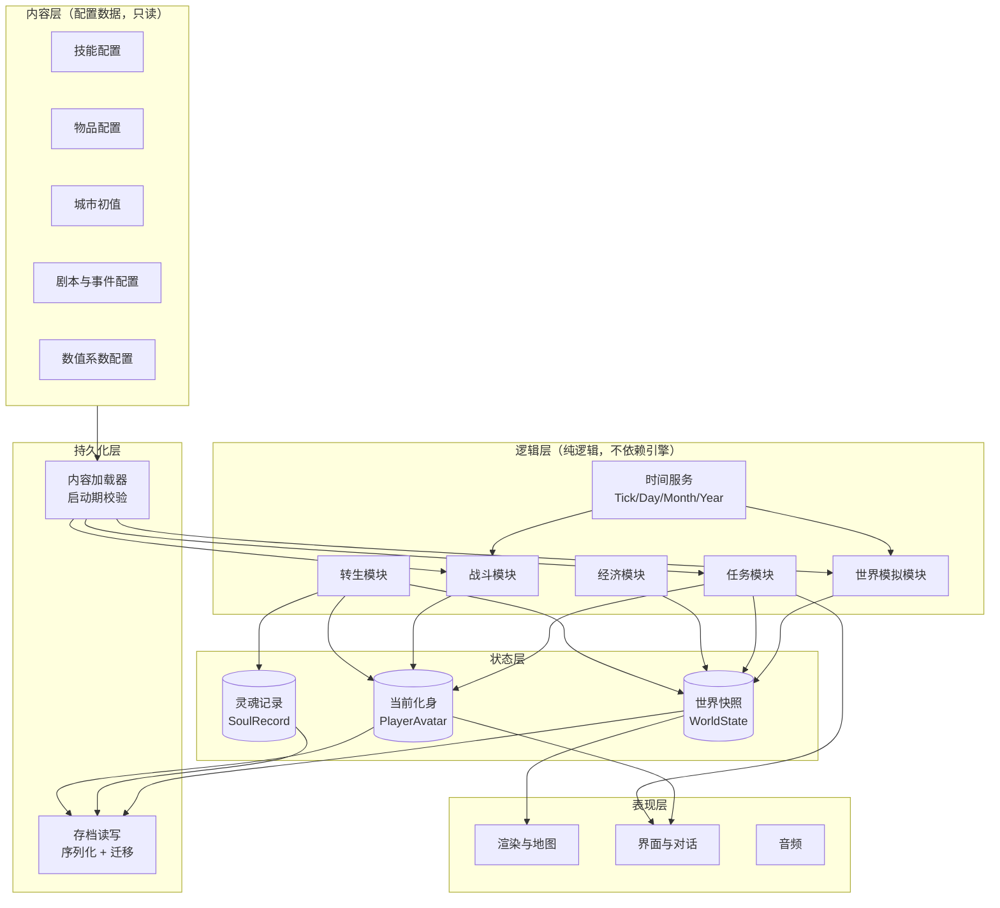
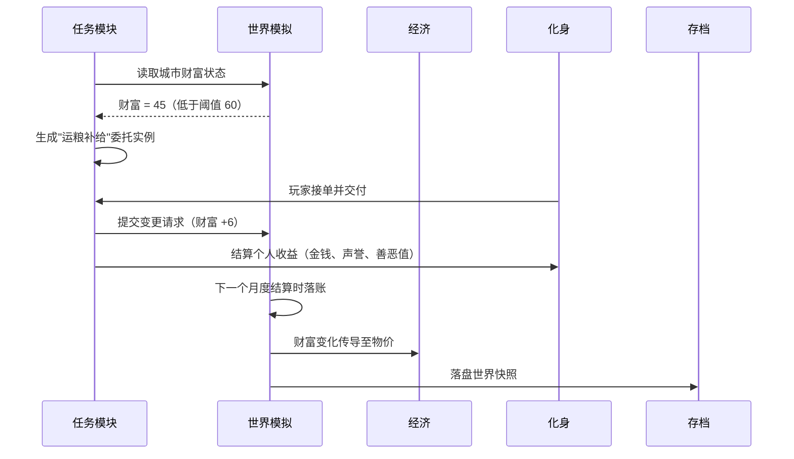
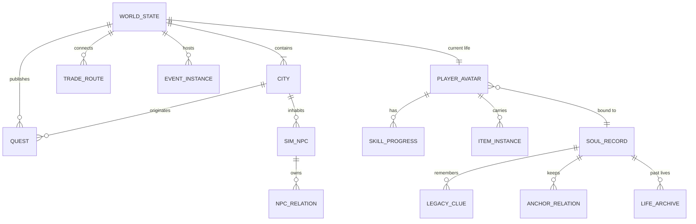
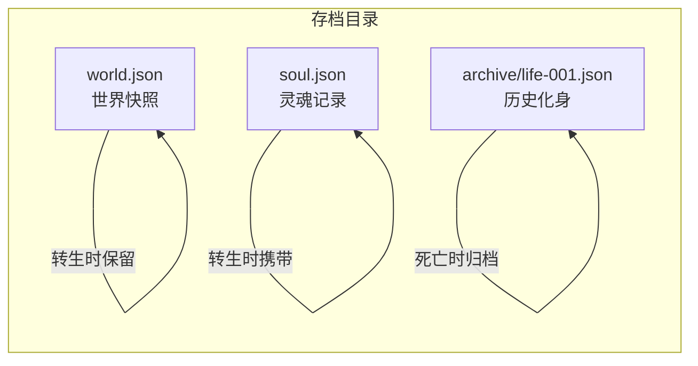
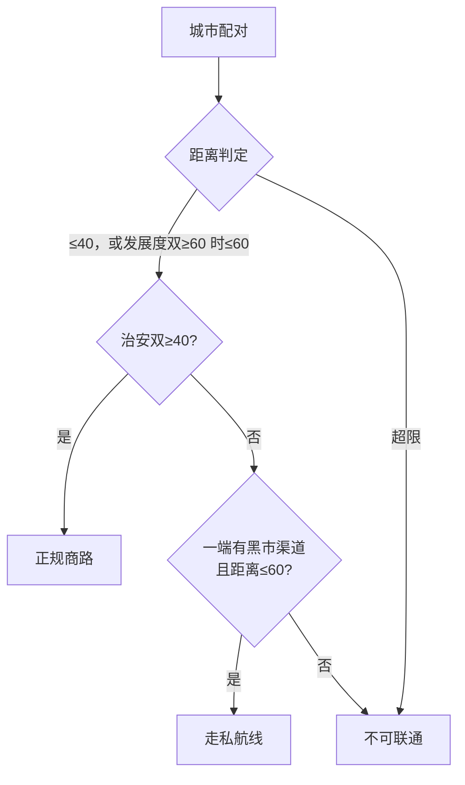
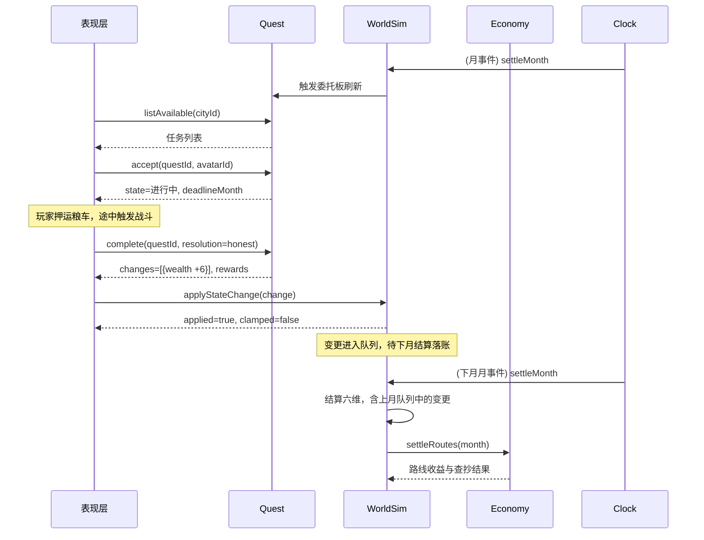

# 《轮回之书》技术设计文档

> 文档类型：组合式设计文档（技术架构概览 + 数据设计）
> 文档阶段：第一期 —— 数据模型与存档格式
> 文档日期：2026-09-15
> 上游文档：《游戏设计文档》《数值框架》《世界模拟量化规则》《世界观与背景设定》及全部剧本文件

---

## 1. 文档定位与范围

### 1.1 分类

| 维度 | 判定 | 依据 |
|------|------|------|
| 文档类型 | 技术架构（概览）+ 数据设计（重点） | 本期核心交付是数据模型与存档格式，架构部分用于交代数据归属 |
| 系统阶段 | Greenfield | 尚无代码库 |
| 受众 | 开发工程师、设计评审者 | 需据此建工程骨架 |
| 复杂度 | Medium | 单机系统，但实体与字段规模大 |
| 上游产物 | 完整设计文档（20 份） | 需求可直接追溯，不需重建 |

### 1.2 本文档覆盖

- 系统架构概览与模块边界（数据归属的依据）。
- 全部核心实体的数据模型与字段定义。
- 存档格式（世界快照与灵魂记录的分离、序列化、版本迁移）。
- 与数据强相关的非功能设计：确定性、快进性能、存档体积。
- 存档与内容数据的错误处理。

### 1.3 本文档不覆盖

- 模块对外接口的完整契约（第二期）。
- MVP 功能拆解与验收标准（第二期）。
- 美术、音频、UI 交互规格。
- 具体数值平衡（全部系数在上游文档标注 `[待 playtest]`，属实现期实测范围）。

### 1.4 需求追溯

| 设计目标 | 上游需求出处 |
|----------|--------------|
| 世界在玩家不干预时持续演化 | 游戏设计文档第 5 章；世界模拟量化规则第 2–7 章 |
| 转生只替换灵魂、世界状态持续累积 | 游戏设计文档第 10 章、第 12 章 |
| 城市六维按月度结算、NPC 按日循环 | 世界模拟量化规则第 1、2、5 章 |
| 技能熟练度用进废退、跨世部分保留 | 数值框架第 5、11 章 |
| 善恶值/幸运跨世留痕，声誉不跨世 | 数值框架第 3 章；委托任务剧本 QT-01 |
| 龙化值与龙魂跨世部分延续 | 龙语符文与龙吼技能表第 2.3、4.2 节 |
| 主线推进度跨世保留 | 永恒者灵魂碎片主线剧本第 13 章 |
| 世界种子可分享、演化可复现 | 游戏设计文档第 12 章 |

### 1.5 术语表

| 术语 | 含义 |
|------|------|
| 世界快照 | 世界在某一时刻的完整状态，跨转生持续累积 |
| 灵魂记录 | 玩家灵魂的跨世数据，转生时替换绑定对象而非重置 |
| 化身 | 当前这一世玩家所控制的身体与角色数据 |
| 模拟 NPC | 有完整行为、关系网、生命周期的 NPC，每城上限 200 |
| 抽象人口 | 仅参与城市状态计算的背景人口，不具象化 |
| 保留率 | 转生时技能与属性的继承比例，`20% + SOU×0.4%`，上限 60% |
| 定点数 | 以整数表示的小数（如 ×1000），用于规避浮点跨平台误差 |
| schemaVersion | 存档格式版本号，驱动迁移链 |

### 1.6 设计目标与约束

| 目标/约束 | 内容 | 证据 |
|-----------|------|------|
| 内容与逻辑分离 | 技能、物品、城市初值、剧本全部外置为配置数据，代码不含硬编码内容 | `[Expert judgment]` |
| 数值可调 | 所有 `[待 playtest]` 系数位于配置文件，调整不需改代码、不需改存档 | `[Data-backed]` 上游文档共标注 6 处待实测系数 |
| 演化可复现 | 同一世界种子在不同机器、不同次数运行时产生相同演化结果 | `[Data-backed]` 游戏设计文档第 12 章 |
| 存档可迁移 | 开发期 schema 变更不导致玩家进度作废 | `[Expert judgment]` |
| 引擎无关 | 数据模型与存档格式不依赖具体引擎 | `[Expert judgment]` 引擎选型未定，见第 7 章 |

---

## 2. 系统架构

### 2.1 架构风格

采用**模块化单体 + 数据驱动**。理由是单机游戏不存在分布式需求，引入服务拆分只增加运行复杂度；而"数据驱动"是本作内容规模（175 技能、8 城、数十条剧本）与数值待调状态下的必然选择 `[Expert judgment]`。

引擎内以**节点与场景**（Godot 的原生组织方式）承载运行时对象，如战斗中的单位与地图上的实体。世界模拟中的 1600 个 NPC 不走这条路——它们是数据记录，只在月度结算时参与批量计算，把它们全部实例化为场景节点会带来无谓的开销 `[Expert judgment]`。存档也不按引擎的节点树序列化，因为节点布局是实现细节，直接持久化会让存档与实现强耦合。

### 2.2 架构图

图中分层链路：内容层是静态配置，启动期由内容加载器读入并校验；逻辑层的六个模块共享一个时钟服务，各自读写状态层；状态层的三个聚合根分别对应世界、灵魂、化身；持久化层只在存读档时介入；表现层只读状态，不反向写入。

### 2.3 模块职责与边界

| 模块 | 职责（单一） | 输入 | 输出 | 依赖 | 边界（不负责） |
|------|--------------|------|------|------|----------------|
| 时间服务 | 提供统一游戏时钟与周期事件派发 | 推进请求 | Tick/Day/Month/Year 事件 | 无 | 不做任何游戏逻辑结算 |
| 世界模拟 | 按周期演化城市状态与 NPC 生命周期 | 时钟事件、世界快照 | 更新后的世界快照 | 时钟、内容配置 | 不处理战斗、不处理玩家属性 |
| 经济 | 结算物价、贸易路线、玩家经营 | 城市状态、贸易路线 | 物价表、城市财富增量 | 世界快照 | 不处理 NPC 个体交易行为 |
| 任务 | 生成、推进、结算任务与后果链 | 城市状态、玩家行为结果 | 任务实例、状态变更请求 | 世界快照、内容配置 | 不直接改城市状态，只提交变更请求 |
| 战斗 | 回合制网格战斗结算 | 参战单位、地形 | 战斗结果、部位伤、掉落 | 内容配置 | 不改世界状态，只产出结果 |
| 转生 | 死亡结算、保留率计算、跨世数据继承 | 化身、灵魂记录、世界快照 | 新的化身 + 更新后的灵魂记录 | 世界模拟、内容配置 | 不决定沉眠年数以外的世界演化 |

一个边界规则值得单独说明：**任务模块不直接写城市状态，而是提交状态变更请求，由世界模拟统一落账**。若不这样约束，任务、事件、玩家行为三条路径会各自修改城市六维，导致结算顺序不可控、后果难以复现 `[Expert judgment]`。

### 2.4 关键数据流

以"完成一次运粮委托"为例，说明模块如何协作：

值得注意的是变更请求在**下一个月度结算时才落账**，而非立即生效。这样做的理由是保证城市状态的每次变更都经过同一套公式与顺序，避免月中多次修改导致状态超出 0–100 边界的叠加错误 `[Expert judgment]`。

### 2.5 技术选型与理由

| 选型项 | 决策 | 理由 | 证据 |
|--------|------|------|------|
| 架构风格 | 模块化单体 | 单机运行，无分布式需求；拆分只增复杂度 | `[Expert judgment]` |
| 内容存储 | JSON 配置，与代码分离 | 内容规模大且持续调整，外置后改内容无需重新编译 | `[Expert judgment]` |
| 运行时对象 | 引擎原生节点/场景 + 数据记录 | 世界模拟的 1600 个 NPC 是数据记录而非运行时实体，只有战斗与地图上的单位需要实体管理，规模不足以支撑引入 ECS 的复杂度 | `[Expert judgment]` |
| 存档格式 | JSON（可读文本） | 单机无体积压力，可读性对调试、手改存档、版本迁移价值高 | `[Expert judgment]` |
| 随机数 | 自定义确定性 RNG + 世界种子 | 保证跨机器演化一致与 bug 可复现 | `[Expert judgment]` |
| 数值表示 | 城市状态演化使用定点整数 | 浮点累加在长周期快进下产生跨平台分叉 | `[Expert judgment]` |
| 游戏引擎 | Godot 4.x | 原生 2D 管线、MIT 许可零成本、可导出为单个可双击启动的 .exe | `[Research-backed]` |

---

## 3. 数据模型

### 3.1 实体总览

实体分四组。世界组（WORLD_STATE 及其下属 CITY、SIM_NPC、TRADE_ROUTE、EVENT_INSTANCE、QUEST）在转生时**完整保留**。灵魂组（SOUL_RECORD 及其下属 LEGACY_CLUE、ANCHOR_RELATION、LIFE_ARCHIVE）跨世**携带**。化身组（PLAYER_AVATAR 及其下属 SKILL_PROGRESS、ITEM_INSTANCE）在转生时**销毁并重建**。配置组（技能、物品、剧本模板）不进入存档，只作引用。

`NPC_RELATION` 是把关系单独建模为实体的，而非内嵌于 NPC 的数组。理由是关系是双向的，且关系网需要支持"查询某 NPC 的所有关系"与"查询两个 NPC 之间的关系"两种访问模式，内嵌会导致数据重复与不一致 `[Expert judgment]`。

### 3.2 世界组实体

#### WORLD_STATE

存档根，单一实例。

| 字段 | 类型 | 约束 | 说明 |
|------|------|------|------|
| schemaVersion | int | 必填 | 存档格式版本，驱动迁移 |
| worldSeed | int64 | 必填，不可变 | 世界种子，决定全部随机 |
| rngState | int64 | 必填 | 确定性 RNG 的当前状态 |
| elapsedMonths | int | ≥ 0 | 自开局起的游戏月数，快进累加 |
| cities | City[] | 长度 8 | 八座城邦 |
| tradeRoutes | TradeRoute[] | 每城 ≤ 3 条 | 贸易路线 |
| events | EventInstance[] | — | 进行中的事件 |
| quests | Quest[] | — | 委托板上的任务 |
| worldFlags | map<string,bool> | — | 主线与全局事件标记 |
| playerAvatar | PlayerAvatar | 必填 | 当前世的化身 |

> `rngState` 单独持久化，是确定性设计的关键：随机流必须随存档一起保存与恢复，否则读档后随机序列会重头开始 `[Expert judgment]`。

#### CITY

| 字段 | 类型 | 约束 | 说明 |
|------|------|------|------|
| cityId | string | 主键 | 如 `aedran`、`port_thorne` |
| population | int | 0–100 | 人口 |
| wealth | int | 0–100 | 财富 |
| development | int | 0–100 | 发展度 |
| security | int | 0–100 | 治安 |
| culture | int | 0–100 | 文化 |
| faction | int | 0–100 | 势力控制 |
| tier | enum | — | 废墟/小镇/城镇/大城，由六维推导 |
| coordX, coordY | int | 0–119 | 120×120 网格坐标，不可变 |
| dominantFactionId | string | — | 当前主导势力 |
| npcIds | string[] | ≤ 200 | 本城模拟 NPC |

六个状态字段全部钳制在 0–100，钳制在每次月度结算后统一执行，这是上游公式明确要求的边界 `[Data-backed]`。

**关于声誉的存放位置**：声誉（Renown）是"城市对玩家的态度"，容易被误放进 CITY。但其上游定义明确为不跨世，且随玩家肉体消亡而消失 `[Data-backed]`（委托任务剧本 QT-01）。因此声誉存放在 `PLAYER_AVATAR.cityReputation`，而非 CITY。这样转生时化身销毁，声誉自然归零，无需额外清理逻辑。

#### SIM_NPC

| 字段 | 类型 | 约束 | 说明 |
|------|------|------|------|
| npcId | string | 主键 | 全局唯一 |
| cityId | string | 外键 | 所属城市 |
| nameKey | string | — | 姓名池键，非明文姓名 |
| gender | enum | — | male/female |
| race | enum | — | 六种族之一 |
| age | int | ≥ 0 | 年龄，按年递增 |
| lifespanBase | int | — | 由种族决定的基础寿命 |
| professionId | string | — | 职业标识 |
| familyId | string | 可空 | 所属家庭 |
| isNamed | bool | — | 是否为世界观文档第七章的手写具名 NPC |
| needs | Needs | — | `{food, money, safety}` 三项需求值 |
| positionId | string | 可空 | 若持有职位（如守卫队长），记录职位 ID |

按上游规则，每城模拟 NPC 数量为 `min(人口 × 3, 200)`，八城合计上限 1600 `[Data-backed]`。

姓名字段存**姓名池键**而非明文，理由是跨文化姓名池的本地化与重命名只需改配置，且避免明文姓名在存档中重复占用体积 `[Expert judgment]`。

#### NPC_RELATION

| 字段 | 类型 | 约束 | 说明 |
|------|------|------|------|
| fromNpcId | string | 外键 | 关系主体 |
| toNpcId | string | 外键 | 关系对象 |
| type | enum | — | 亲属/同事/好友/仇敌/配偶 |
| value | int | -100–100 | 关系值 |

关系按上游初始值范围生成：亲属 +40~+80、同事 +10~+30、好友 +20~+50、仇敌 -30~-60 `[Data-backed]`。关系值随互动演化，婚姻与繁衍会新增关系行。

#### TRADE_ROUTE

| 字段 | 类型 | 约束 | 说明 |
|------|------|------|------|
| routeId | string | 主键 | — |
| cityA, cityB | string | 外键 | 两端城市 |
| distance | int | — | 曼哈顿距离，可由坐标推导 |
| establishedMonth | int | — | 建立时的 elapsedMonths |
| ownerAvatarId | string | 可空 | 若被玩家垄断，记录归属 |

贸易路线的建立条件（距离 ≤ 40，发展度 ≥ 60 时放宽至 ≤ 60，双方治安 ≥ 40，每城上限 3 条）取自上游 `[Data-backed]`。

#### QUEST

| 字段 | 类型 | 约束 | 说明 |
|------|------|------|------|
| questId | string | 主键 | — |
| templateId | string | 外键 | 指向剧本配置 |
| type | enum | — | 运粮/剿匪/修缮/办学/护送/平叛 |
| originCityId | string | 外键 | 发布城市 |
| giverNpcId | string | 可空 | 委托人 |
| state | enum | — | 待接/进行中/已完成/已失效 |
| difficulty | enum | — | 小/中/大 |
| rewardSnapshot | Reward | — | 生成时的报酬快照 |
| stateChanges | StateChange[] | — | 完成后要提交的城市状态变更 |
| deadlineMonth | int | 可空 | 过期时间 |

`rewardSnapshot` 与 `stateChanges` 在任务**生成时**确定并冻结，而非完成时再计算。理由是任务生成时的城市状态与完成时可能不同，完成时重算会导致"同样的任务报酬随世界状态漂移"，玩家无法预期 `[Expert judgment]`。

#### EVENT_INSTANCE

| 字段 | 类型 | 约束 | 说明 |
|------|------|------|------|
| eventId | string | 主键 | — |
| templateId | string | 外键 | 如 `ev_01_undead_tide` |
| cityId | string | 外键 | 发生城市 |
| phase | int | — | 事件阶段 |
| triggeredMonth | int | — | 触发时间 |
| participantNpcIds | string[] | — | 参与 NPC |
| resolved | bool | — | 是否已解决 |

事件模板（EV-01~08）的流程与分支在对白剧本中已定义，存档只记录**实例状态**，不复制剧本文本。

### 3.3 化身组实体

#### PLAYER_AVATAR

当前世的角色数据，转生时整体销毁重建。

| 字段 | 类型 | 约束 | 说明 |
|------|------|------|------|
| avatarId | string | 主键 | 本世唯一 |
| soulId | string | 外键 | 绑定的灵魂 |
| name | string | — | 明文姓名（玩家自定） |
| gender, age, race, backgroundId | — | — | 身份信息 |
| attributes | Attributes | 七维，见下 | 力量/敏捷/体质/智力/感知/魅力/灵魂 |
| derived | Derived | — | 生命/魔力/行动点/时间单位等派生值 |
| karma | int | -100–100 | 善恶值（本世视图） |
| luck | int | -100–100 | 幸运（本世视图） |
| cityReputation | map<cityId,int> | 各 -100–100 | 每城声誉（不跨世） |
| skills | SkillProgress[] | 见 3.4 | 技能熟练度 |
| talents | string[] | — | 天赋 ID |
| flaws | string[] | — | 缺陷 ID |
| bodyParts | map<slot,BodyPartState> | — | 六个部位的伤势 |
| equipment | map<slot,itemInstanceId> | — | 装备槽 |
| inventory | itemInstanceId[] | — | 背包 |
| money | int | ≥ 0 | 货币 |
| dragonization | int | 0–100 | 龙化值 |
| dragonSoul | int | 0–10 | 龙魂存量 |
| knownRunes | string[] | — | 已习得龙语符文 |
| hostAvatarId | string | 可空 | 随机转生时的原宿主（用于既有历史与待办） |

`karma` 与 `luck` 在化身与灵魂记录中各存一份，两者含义不同：化身侧是**本世视图**，灵魂侧是**跨世累计**。转生时由灵魂侧派生初值写入新的化身，而非直接拷贝——因为上游规定极端善恶值只在转生时"留下业"影响开局事件，而非原样继承 `[Data-backed]`。

`hostAvatarId` 支持上游的随机转生玩法：玩家继承的是一具已有的身体，该身体带有既有债务、亲属与未了之事 `[Data-backed]`。

#### Attributes 与 Derived

七维属性与上游定义一致 `[Data-backed]`：

| 字段 | 范围 | 作用摘要 |
|------|------|----------|
| STR | 1–100+ | 近战伤害、破甲、负重 |
| DEX | 1–100+ | 行动点恢复、闪避、暴击 |
| CON | 1–100+ | 最大生命、耐力、毒抗 |
| INT | 1–100+ | 魔法伤害、最大魔力 |
| PER | 1–100+ | 命中、侦查、远程伤害 |
| CHA | 1–100+ | 交易折扣、好感、说服 |
| SOU | 1–100+ | 灵魂系魔法、转生保留率 |

派生值（HP、MP、AP、TU、负重上限、闪避、命中）**不落盘**，每次由属性、装备、部位状态重新计算。落盘派生值会导致属性变更后派生值不同步，是典型的存档不一致来源 `[Expert judgment]`。

#### ITEM_INSTANCE

| 字段 | 类型 | 说明 |
|------|------|------|
| itemInstanceId | string | 实例主键 |
| templateId | string | 指向物品配置 |
| durability | int | 当前耐久 |
| enhancement | int | 附魔/强化等级 |
| modifiers | Modifier[] | 实例特有的词缀 |

模板与实例分离，理由是同一把"铁剑"的模板唯一，但每个实例的耐久、强化、词缀不同。存档只存实例，模板由配置提供 `[Expert judgment]`。

### 3.4 灵魂组实体

#### SOUL_RECORD

跨世携带的核心数据，体积小但字段语义最重。

| 字段 | 类型 | 约束 | 说明 |
|------|------|------|------|
| soulId | string | 主键，永恒不变 | 灵魂唯一标识 |
| reincarnationCount | int | ≥ 0 | 转生次数 |
| lastRetention | float | 0–0.6 | 上次结算的保留率 |
| inheritedSkills | map<skillId,int> | — | 保留后的技能熟练度 |
| inheritedAttrBonus | Attributes | — | 属性继承加成 |
| karmaCarry | int | -100–100 | 跨世善恶痕迹 |
| luckCarry | int | -100–100 | 跨世幸运 |
| legacyClues | LegacyClue[] | — | 前世遗产线索 |
| anchorRelations | AnchorRelation[] | — | 锚点 NPC 的好感与记忆 |
| mainQuestProgress | MainQuestState | — | 主线推进度 |
| dragonizationCarry | int | 0–100 | 龙化残留 |
| knownRunes | string[] | — | 已习得符文（跨世延续） |
| lifeArchives | LifeArchive[] | — | 过往各世的快照 |

保留率公式 `20% + SOU×0.4%`（上限 60%）与属性继承系数 `× 保留率 × 0.3` 取自上游 `[Data-backed]`。

`lifeArchives` 的用途不止于怀旧。古龙瓦洛克试炼的第二幕需要呈现"前世记忆碎片"，其数据来源即为该字段 `[Data-backed]`。

#### LegacyClue 与 AnchorRelation

| 实体 | 字段 | 说明 |
|------|------|------|
| LegacyClue | clueId, description, targetCityId, targetAssetId, redeemed | 前世资产转化成的线索，经收债人赎回 |
| AnchorRelation | anchorId, affinity, memoryFlags | 锚点 NPC 对玩家的好感与记忆标记 |

锚点 NPC 的关系必须跨世保留——这是锚点机制成立的前提，上游明确五位的存在理由即"不随世代消亡" `[Data-backed]`。

#### LIFE_ARCHIVE

| 字段 | 类型 | 说明 |
|------|------|------|
| archiveId | string | 主键 |
| soulId | string | 外键 |
| avatarSnapshot | PlayerAvatar | 该世结束时的化身快照 |
| endedMonth | int | 结束时的世界历 |
| deathCause | enum | 寿终/战死/意外 |
| worldImpact | WorldImpact | 该世对世界的留存影响摘要 |

#### MainQuestState

| 字段 | 类型 | 说明 |
|------|------|------|
| fragmentsCollected | string[] | 已收集的碎片，如 `fire`、`water` |
| cluesKnown | string[] | 已获线索标记 |
| thirdActStarted | bool | 第三幕是否开启 |
| grayRobeAttitude | enum | 灰袍者对玩家的态度 |

碎片与灵魂绑定、跨世不丢失，上游已明确 `[Data-backed]`。

### 3.5 配置组（不入存档）

以下数据只作引用，不复制进存档：

| 配置 | 内容 | 引用方式 |
|------|------|----------|
| 技能配置 | 175 个技能的定义、阶位、AP、冷却、伤害 | 按 `skillId` 引用 |
| 物品配置 | 武器/防具/材料/道具模板 | 按 `templateId` 引用 |
| 城市配置 | 城市名称、坐标、初始六维 | 开局读取一次 |
| 数值系数 | 全部 `[待 playtest]` 系数的默认值 | 启动期读入 |
| 剧本配置 | 事件与任务的流程、分支、对白 | 按 `templateId` 引用 |

不复制进存档的理由：这些数据体积大且会随版本更新，复制会导致存档膨胀与"旧存档用旧数值"的诡异行为 `[Expert judgment]`。

### 3.6 数据一致性规则

| 规则 | 内容 |
|------|------|
| 城市六维边界 | 每次月度结算后统一钳制至 0–100 |
| 关系对称 | `NPC_RELATION` 的双向记录必须同时写入或同时失败 |
| 引用完整性 | 存档中引用的 `skillId`/`templateId` 必须在配置中存在，启动期校验 |
| 单一存档根 | `WORLD_STATE` 是唯一根，其余实体均可达 |
| 声誉归属 | 声誉只在化身，不写入城市 |
| 派生值不落盘 | HP/MP/AP 等由属性重算，不持久化 |

---

## 4. 存档格式

### 4.1 文件划分与生命周期

存档拆为三个部分，生命周期各不相同：

| 文件 | 内容 | 转生时的处理 | 体积量级 |
|------|------|--------------|----------|
| `world.json` | `WORLD_STATE` 全量 | 保留，快进推进 | 主文件，随世代增长 |
| `soul.json` | `SOUL_RECORD` | 携带，替换化身绑定 | 恒定，很小 |
| `archive/life-NNN.json` | `LIFE_ARCHIVE` | 追加一份，只增不改 | 每世一份 |

分离存储的直接收益是转生操作只涉及 `soul.json` 与化身重建，`world.json` 不加不减——这正是上游"转生只替换灵魂绑定、世界状态持续累积"要求的落地方式 `[Data-backed]`。

### 4.2 序列化格式

采用 JSON，理由有三 `[Expert judgment]`：

1. 存档是玩家数十小时的进度，出问题时能直接打开查看，调试成本远低于二进制。
2. 版本迁移需要改写字段，文本格式的迁移函数更易写、易测。
3. 单机游戏无网络传输与体积压力，JSON 的解析开销不构成瓶颈。

体积问题由压缩解决：写入时对 JSON 做通用压缩，读档时解压。这样既保留可读性（可提供未压缩的调试导出），又不牺牲实际占用。

### 4.3 版本迁移机制

`schemaVersion` 是迁移的唯一依据，迁移链按版本逐级推进：

规则 `[Expert judgment]`：

- 每个版本提供一个**纯函数**迁移步骤，输入旧版本结构，输出新版本结构，不做任何 IO。
- 迁移链逐级执行，禁止跨版本跳跃——跨版本迁移的组合数量会随版本数平方增长，无法维护。
- 迁移前自动备份原文件到 `backup/`，迁移失败时保留原文件并提示玩家。
- 迁移函数必须有对应的测试样例：每个历史版本一份样例存档，作为回归测试输入。

上游文档中所有 `[待 playtest]` 标记的系数都存放在**配置**而非存档中，因此调整数值不需要迁移 `[Data-backed]`。这是把数值外置的一个额外收益：开发期最频繁的改动不会触碰存档格式。

### 4.4 存档体积估算

以模拟 NPC 上限计算 `[Hypothesis]`：

| 部分 | 数量 | 单条估算 | 小计 |
|------|------|----------|------|
| 模拟 NPC | 1600 | 约 400 字节 | 约 640 KB |
| NPC 关系 | 每 NPC 约 6 条，合计约 9600 | 约 60 字节 | 约 576 KB |
| 城市 | 8 | 约 500 字节 | 约 4 KB |
| 任务与事件 | 约 100 | 约 500 字节 | 约 50 KB |
| 化身与物品 | — | — | 约 50 KB |
| 历史化身 | 每世约 20 KB | 10 世约 200 KB | 约 200 KB |

合计约 1.5 MB，压缩后预计降至数百 KB 量级。该估算为量级判断，实际数值需在实现后测量 `[Hypothesis]`。

---

## 5. 非功能设计

### 5.1 确定性

确定性是本作的技术底线：玩家需能分享世界种子，bug 需能复现。三项措施 `[Expert judgment]`：

1. **随机源统一**。禁用语言与引擎的内置随机函数，全部随机经由一个确定性 RNG，其状态（`rngState`）随存档持久化。
2. **定点数运算**。城市六维的月度公式含 `× 0.008`、`× 0.4` 一类系数，统一放大为定点整数运算（如 ×1000）。浮点累加在 1200 次迭代后会产生跨平台差异，而城市状态又会被钳制到整数，微小的浮点差可能导致钳制结果不同，进而分叉 `[Expert judgment]`。
3. **结算顺序固定**。城市按 `cityId` 排序结算，NPC 按 `npcId` 排序结算，禁止依赖哈希容器的遍历顺序。

### 5.2 快进性能

转生沉眠需要一次性推进数十至百年，是唯一存在性能风险的操作。以 100 年为例 `[Hypothesis]`：

| 计算项 | 规模 | 复杂度 |
|--------|------|--------|
| 城市六维月度结算 | 8 城 × 1200 月 | 9600 次 |
| NPC 年龄与死亡结算 | 1600 NPC × 100 年 | 16 万次 |
| NPC 需求更新 | 1600 NPC × 1200 月 | 192 万次 |
| NPC 迁移决策 | 1600 NPC × 1200 月 | 192 万次 |

若迁移决策按"NPC 两两比较"实现，复杂度会升至 192 万 × 1600 量级，不可接受。设计中迁移决策比较的是**城市吸引力向量**而非 NPC 个体：每个结算月先计算 8 城的吸引力，NPC 只做一次查表比较 `[Expert judgment]`。上游的迁移公式本身就是城市级量（`财富/100 × 0.4 + 治安/100 × 0.4 + 文化/100 × 0.2`），与该优化天然契合 `[Data-backed]`。

另外两项优化：NPC 年龄与死亡按**年**结算而非按月，因为年龄以年为单位；快进期间跳过所有表现层更新与事件演出。

### 5.3 加载与启动

启动期做一次全量内容校验：扫描存档中出现的全部 `skillId`、`templateId`、`cityId`，与配置数据比对，任何缺失即报错并指名具体 ID。这类错误若延迟到运行时才爆发，表现是"某个 NPC 突然消失"或"某个技能无效果"，排查成本远高于启动期直接失败 `[Expert judgment]`。

---

## 6. 错误处理

| 场景 | 处理 | 理由 |
|------|------|------|
| 存档文件损坏（无法解析） | 校验失败则尝试 `backup/` 中的上一份存档，仍失败则明确告知玩家并保留原文件 | 存档承载数十小时进度，任何情况下不得静默丢弃 `[Expert judgment]` |
| 版本迁移失败 | 中止迁移，保留原文件与备份，提示玩家版本不兼容并附原始错误 | 迁移失败时的最坏结果是"存档打不开"，最坏中的最坏是"存档被改坏" `[Expert judgment]` |
| 内容引用缺失 | 启动期报错，列出缺失 ID 与引用位置 | 提前失败优于运行时诡异表现 `[Expert judgment]` |
| 配置数据格式错误 | 启动期校验必填字段与取值范围，报错并指出文件与行号 | 配置由人手工编辑，错误概率高于代码 `[Expert judgment]` |
| 快进中断（玩家退出） | 快进为纯函数式批量结算，未落盘则下次读档重算，不做断点续算 | 快进的输入（世界快照 + 沉眠年数）完全确定，重算成本可接受，断点续算会引入额外的中间状态与不一致风险 `[Expert judgment]` |

---

## 7. 待确认事项

| 事项 | 现状 | 影响 |
|------|------|------|
| 游戏引擎具体版本 | 已定 Godot 4.x，小版本未定见第 11 章 | 影响可用 API 与导出选项，开工时确定 `[待确认]` |
| 脚本语言 | GDScript 与 C# 均在 Godot 支持范围内，未选定 | GDScript 迭代快、贴近引擎；C# 类型更严、重数值逻辑更稳。本作以数值与数据为主，见 11.3 `[待确认]` |
| 存档压缩算法 | 未定 | 影响读档速度与体积，实现期确定 `[待确认]` |
| 历史化身的保留上限 | 未定，估算按 10 世 | 直接决定存档长期体积增长 `[待确认]` |
| 幂等与并发 | 不适用 | 单机单线程，无并发写入场景，故本设计不含分布式错误处理 |
| 第二期内容 | 已交付 | MVP 功能拆解（第 8 章）与模块接口契约（第 10 章） |

---

## 8. MVP 功能拆解

### 8.1 拆分依据

上游为原型设定的验证问题只有一句：玩家能否在没有主线的情况下，仅凭"世界会回应我"这一点，产生持续游玩的动力 `[Data-backed]`（游戏设计文档第 14 章）。

这个问题的措辞决定了拆分的取舍标准。它要验证的是**世界对玩家行为的回应是否可被感知**，而不是内容量、剧情深度或系统数量。因此凡是不能增强"回应可感知性"的功能，一律不进 MVP；凡是能让"回应"变得可见的机制，哪怕技术上不轻松，也要保留。

据此得到三条取舍原则 `[Expert judgment]`：

1. **可观测优先**。世界演化的结果必须能被玩家直接看到，否则"世界会回应我"无从验证。
2. **闭环优先于规模**。宁可两座城把闭环走通，也不要八座城各自半成品。
3. **战斗够用即可**。战斗是"行动"的一种载体，MVP 阶段的战斗只要能让玩家产生后果，不需要深度。

### 8.2 范围确定

上游原型目标的表述是"一座城市 + 城市状态模拟 + 自由生成/随机转生 + 委托板任务 + 网格回合战斗"。按 8.1 节第一条原则，**城市数由 1 调整为 2**，已确定 `[Expert judgment]`。

理由是城市模拟的两个主要产出是贸易与人口迁移，二者都以**城际差异**为前提。单城状态下，净移民公式没有目标城可算，贸易路线数为零，六维演化的联动链条会断掉大半——玩家看到的只是一组数字缓慢漂移，感受不到"城市因为彼此而变化"。

两城需满足上游的贸易路线条件才能联通。上游已补充走私航线规则（见第 9 章），因此联通判定分正规与走私两条通道。按开局八城复核 `[Data-backed]`：

| 候选配对 | 距离 | 正规商路 | 走私航线 | 结论 |
|----------|------|----------|----------|------|
| 索恩港 ↔ 艾德兰 | 55 | 成立（发展度 75/70，阈值放宽至 60） | — | 可联通 |
| 艾德兰 ↔ 银月塔 | 30 | 成立 | — | 可联通 |
| 艾德兰 ↔ 铁锤堡 | 45 | 成立（发展度 70/65） | — | 可联通 |
| 艾德兰 ↔ 霜语堡 | 38 | 成立 | — | 可联通 |
| 索恩港 ↔ 十字路 | 55 | 不成立（十字路发展度 50 < 60） | 成立（55 ≤ 60，索恩港有黑市渠道） | 可联通 |
| 艾德兰 ↔ 十字路 | 30 | 不成立（十字路治安 20 < 40） | 成立（艾德兰有黑市渠道） | 可联通 |
| 银月塔 ↔ 十字路 | 30 | 不成立（十字路治安 20 < 40） | 成立（十字路有黑市渠道） | 可联通 |
| 绿荫 ↔ 赤沙 | 20 | 不成立（赤沙治安 30 < 40） | 成立（绿荫有黑市渠道） | 可联通 |
| 银月塔 ↔ 绿荫 | 55 | 不成立（绿荫发展度 45 < 60） | 不成立（两端治安达标，走私前提不适用） | 不可联通 |

**已定配对：索恩港 + 艾德兰。** 决定依据是游戏性而非实现成本：这两座城的六维反差最大（财富 90 / 65，治安 40 / 60，文化 55 / 75），玩家一进城就能感到"城市有各自的性格"，而城市性格差异正是后续所有演化可观测的前提 `[Expert judgment]`。

配套的 MVP 事件定为 **EV-02 海怪封港**。其触发条件是"索恩港财富 ≥ 75 且有血腥味"，索恩港开局财富 90，条件开局即满足，不需玩家先做前置任务 `[Data-backed]`。选它而非 EV-03 的理由是紧迫感：封港会造成物价飞涨、财富每月下跌，玩家能直接看到"世界正在变坏"，从而被推动去行动——这正是验证"世界会回应我"所需要的压力。

> 已排除的备选：「艾德兰 + 银月塔」配 EV-03 巫妖的命匣。该方案对战斗系统的成熟度要求更低（调查型事件，不必讨伐 BOSS），但两城六维偏接近，且事件缺少"世界正在恶化"的紧迫感。若实现阶段发现 BOSS 战成本超出预期，可退回此备选。

### 8.3 范围清单

| 必做 | 说明 |
|------|------|
| 两城 + 六维月度演化 + 阶段推导 | 世界模拟的可观测核心 |
| 模拟 NPC 生成、生命周期、迁移决策 | 让城市"有人"，迁移是可视化的世界回应 |
| 自由生成开局 | 玩家能创建角色 |
| 随机转生开局 | 招牌玩法，且直接产出"既有历史与待办" |
| 委托板任务生成、交接、状态变更落账 | 玩家行为改写世界的主通道 |
| 网格回合战斗 | AP/TU、命中、伤害、部位伤、非致命、掉落 |
| 地图移动与基础界面 | 观察与行动的入口 |
| 城市状态可视化 | 让"世界变化"肉眼可见 |
| 时间加速 | 两小时的验证窗口内看到演化 |
| 城市事件 EV-02 | 世界自主出事的样本 |
| 存档读写与迁移框架 | 没有存档无法做长时间验证 |

| 明确不做 | 归属阶段 |
|----------|----------|
| 八城全量与城际贸易网络 | 垂直切片 |
| 跨世转生循环（死亡→沉眠→快进→新生） | 垂直切片 |
| 龙吼、龙化、龙魂 | Beta |
| 主线碎片、锚点 NPC、漂移者与乱入者 | Beta |
| 势力系统、政治操作、经营（店铺/放贷） | Beta |
| 隐藏属性事件脚本（保留属性本身，不接 11 个事件） | Beta |
| 生产技能与配方链、装备附魔强化 | Beta |
| 多层地牢与 BOSS 战 | Beta |

值得说明两处边界。**隐藏属性的属性本身要在 MVP 中保留**（善恶、幸运、声誉随行为变化），因为委托奖励与物价受声誉影响；但不接入那 11 个事件脚本，那是内容而非机制 `[Expert judgment]`。**随机转生开局要在 MVP 中保留**，但它与"跨世转生循环"是两件事：前者是开局方式的选择项之一，后者是死亡后的世代推进，后者属垂直切片 `[Data-backed]`（游戏设计文档第 4.2 节与第 14 章分别定义）。

### 8.4 功能项拆解

功能编号沿用第 2.3 节的模块划分。验收标准写成可判定的事实，而非"功能正常"这类无法证伪的描述。

**M1 骨架**

| 编号 | 功能项 | 依赖 | 验收标准 |
|------|--------|------|----------|
| M1.1 | 时间服务：Tick/Day/Month/Year 推进与周期事件派发 | 无 | 推进一年产生 12 次月结算、360 次日结算；同一世界种子两次运行后 `elapsedMonths` 相同 |
| M1.2 | 内容加载器：启动期读入配置并校验 | 无 | 配置缺字段或取值越界时启动失败，报错指明文件名与字段名 |
| M1.3 | 存档读写：三文件读写与完整性校验 | M1.2 | 存读档往返后 `WORLD_STATE` 逐字段相等 |
| M1.4 | 版本迁移框架 | M1.3 | 提供 v1 样例存档，迁移函数对其执行后通过结构校验 |

**M2 世界模拟**

| 编号 | 功能项 | 依赖 | 验收标准 |
|------|--------|------|----------|
| M2.1 | 城市六维月度演化 | M1.1 | 两城连续演化 120 月，每步六维均落在 0–100；同一世界种子结果逐月一致 |
| M2.2 | 城市阶段推导与建模变化标记 | M2.1 | 六维跨越档位边界时阶段值更新，并产出建模变化标记 |
| M2.3 | 模拟 NPC 生成（姓名、年龄、职业、家庭） | M1.2 | 生成数量等于 `min(人口×3, 200)`；同家庭 NPC 全部建立亲属关系 |
| M2.4 | NPC 生命周期（年龄、死亡、职位继承） | M2.3 | 按年结算年龄；具名 NPC 死亡后其职位由新 NPC 接替 |
| M2.5 | NPC 迁移决策 | M2.1、M2.3 | 按城市吸引力向量计算；构造一座治安与财富双低城市后，其人口在 24 个月内持续净流出 |
| M2.6 | 时间加速 | M2.1 | 可一次推进 N 月并输出六维变化序列，用于观察演化曲线 |

**M3 开局**

| 编号 | 功能项 | 依赖 | 验收标准 |
|------|--------|------|----------|
| M3.1 | 自由生成 | M1.2 | 可选种族、出身、属性分配、天赋与缺陷配对；缺陷数与天赋数相等才允许开局 |
| M3.2 | 随机转生开局 | M2.3、M3.1 | 随机产出宿主，宿主带有非空的既有债务或亲属或待办中的至少一项 |

**M4 任务**

| 编号 | 功能项 | 依赖 | 验收标准 |
|------|--------|------|----------|
| M4.1 | 委托板生成 | M2.1 | 按六维阈值生成任务；将某城对应状态压低后，该类型任务出现概率上升 |
| M4.2 | 委托交接与状态变更落账 | M4.1 | 完成后提交变更请求，城市状态在下一个整月结算时改变，月中不变 |
| M4.3 | 后果链记录 | M4.2 | 任务结果写入世界标记，后续任务生成时可读到该标记 |

**M5 战斗**

| 编号 | 功能项 | 依赖 | 验收标准 |
|------|--------|------|----------|
| M5.1 | 网格回合与 AP/TU | M1.3 | 高敏捷单位在同等时间内出手次数多于低敏捷单位 |
| M5.2 | 命中与伤害结算 | M5.1 | 命中率符合 `50% + 熟练度×0.5% + PER×0.4 + DEX×0.2 - 目标闪避`；伤害符合"加算减法"减伤 |
| M5.3 | 部位伤与状态 | M5.2 | 腿部受伤降低移动力，手臂受伤降低命中，伤口需处理才能恢复 |
| M5.4 | 非致命与倒地处理 | M5.2 | 可对倒地者选择搜身、俘虏、放走、补刀，四种选择产生不同的世界标记 |
| M5.5 | 掉落结算 | M5.2 | 掉落稀有度随 TL 与幸运变化 |

**M6 呈现**

| 编号 | 功能项 | 依赖 | 验收标准 |
|------|--------|------|----------|
| M6.1 | 地图与移动 | M5.1 | 120×120 网格，两城之间可往返移动 |
| M6.2 | 基础界面 | M1.3 | 含角色面板、背包、任务列表、对话 |
| M6.3 | 城市状态可视化 | M2.1 | 城市六维及其变化可被玩家直接查看 |

**M7 事件**

| 编号 | 功能项 | 依赖 | 验收标准 |
|------|--------|------|----------|
| M7.1 | 城市事件 EV-02 海怪封港 | M4.3、M5.5 | 索恩港财富 ≥ 75 时触发；三条分支各自产出不同的城市状态后果 |

### 8.5 内容规模裁剪

MVP 需要的不是全部内容，而是够用的样本 `[Expert judgment]`：

| 内容类别 | 全量 | MVP 取用 | 取用依据 |
|----------|------|----------|----------|
| 技能 | 175 | 约 35 | 武器取剑、斧、弓三类；法术取火、水两系；战斗技艺取 5 个；专长取 4 个 |
| 物品 | — | 约 40 | 三类武器各按稀有度取档，防具三类，消耗品（药品、食物）若干 |
| NPC 职业 | 22 | 12 | 六个职业类别各取 2 个 |
| 委托任务 | 6 类 | 6 类全部 | 委托板是核心闭环，六类都要有 |
| 城市事件 | 8 | 1 | 只做 EV-02 |
| 城市 | 8 | 2 | 见 8.2 范围调整建议 |

技能取三武器两法术，覆盖近战、远程、元素、治疗四种战术位，足以验证战斗闭环；不需要在 MVP 阶段验证 175 个技能的平衡。

### 8.6 依赖顺序与里程碑

顺序不能压缩的两处依赖：里程碑 2 必须早于里程碑 3，因为随机转生开局要读取已生成的 NPC 池；里程碑 4 必须晚于里程碑 3，因为委托的状态变更需要玩家有行动手段去完成它。

### 8.7 核心假设的验收方式

验证问题必须能用可观察的行为判定，否则拆解得再细也无法回答 `[Hypothesis]`：

1. 招募 3–5 名未参与本设计的人，从零开始连续游玩。
2. 观察点一：游玩两小时后，在不查看任何日志或提示的前提下，玩家能否说出至少三件"因为我做了什么，这座城市变成了这样"的事。能说出，说明"世界会回应我"被感知到了。
3. 观察点二：玩家是否会主动去做一件"没有任务要求、但可能改变城市"的事。会，说明玩家理解了世界可被影响，而非只在刷任务。
4. 观察点三：时间加速后，玩家是否会去查看城市状态的变化。会，说明世界演化进入了玩家的关注范围。

任一项不通过，问题都指向同一个环节——"影响"与"传承"之间的可观测性设计，而不是内容量不足。这种情况下继续加内容不会改善结果。

### 8.8 MVP 风险

| 风险 | 表现 | 应对方向 |
|------|------|----------|
| 世界演化不可观测 | 玩家只在做任务攒钱，对城市变化无感知，验证失败 | 首轮应对已落地：M6.3 城市状态面板（逐项归因 + 六维历史趋势 + 升阶/降级提示，T 键开启）。委托结算后的直接反馈待 M4 接入后再补 |
| 战斗深度拖慢原型 | 在部位伤、元素连锁上投入过多，闭环迟迟不成形 | MVP 阶段战斗做到"能打且有后果"即停，深度留给垂直切片 |
| 两城样本过小 | 贸易与迁移现象不显著，演化看起来仍是数字漂移 | 时间加速拉长观察窗口；若仍不明显，补第三城而非加深单城 |
| 内容裁剪后玩法单薄 | 35 个技能与 40 件物品在长时间游玩后重复感强 | 接受此风险。MVP 验证的是回应可感知性，不是内容耐玩度 |
| 走私航线打破经济平衡 | 走私收益高于正规商路，若查抄风险偏低，玩家可能全走走私，正规商路形同虚设 | 查抄概率与收益系数均为初值，需在原型阶段实测；若走私成为唯一最优解，则上调查抄概率或下调走私收益 |

---

## 9. 上游规则修订记录

实现前复核了上游《世界模拟量化规则》的贸易路线规则，发现 9.3 节的判定门槛与 9.4 节列出的 7 条开局预置路线之间存在冲突，据此做了一次修订。记录如下，供后续追溯。

### 9.1 发现的问题

9.3 节定义三条门槛：基础距离 ≤ 40；双方发展度均 ≥ 60 时阈值放宽至 60；双方治安 ≥ 40。按此复核 9.4 节列的 7 条"已满足条件"的预置路线，其中 4 条不成立：

| 原列出的路线 | 原标注 | 冲突点 |
|--------------|--------|--------|
| 索恩港 ↔ 十字路 | 55（发展度加成） | 十字路发展度 50 < 60，不满足加成前提，阈值仍为 40，55 > 40 |
| 银月塔 ↔ 绿荫 | 55（发展度加成） | 绿荫发展度 45 < 60，同上 |
| 艾德兰 ↔ 十字路 | 30 | 十字路治安 20 < 40，违反治安门槛 |
| 绿荫 ↔ 赤沙 | 20 | 赤沙治安 30 < 40，违反治安门槛 |

四条冲突分两类：两条是距离超标，两条是治安不达标。修订需要同时处理这两类。

### 9.2 修订方案

最初考虑过两种修法：直接删除 4 条不成立的路线（保持规则严格），或放宽治安门槛（保住路线但削弱规则）。两者都不理想——前者是删减内容，后者让"治安"这一维失去对贸易的约束力。

改采第三条路：**为治安不达标的城市增设一条平行的贸易通道「走私航线」**。规则不放松，而是多一种玩法。

走私航线与正规商路的差异：

| 项 | 正规商路 | 走私航线 |
|------|----------|----------|
| 治安门槛 | 双方 ≥ 40 | 无 |
| 距离上限 | ≤ 40，发展度双 ≥ 60 时 ≤ 60 | ≤ 60 |
| 路线上限 | 每城 3 条 | 每城 2 条 |
| 建立前提 | 无 | 至少一端有黑市渠道（十字路、赤沙、索恩港） |
| 月收益 | 财富 +0.5、文化 +0.2 | 财富 +0.8、文化 +0.05 |
| 查抄风险 | 无 | 每月概率 = 该城治安/100 × 0.2；被查抄则当月收益归零，该城声誉 -5、玩家善恶值 -2 |

这个方案在游戏性上有三处收益 `[Expert judgment]`：

1. **治安维度获得双向价值**。治安高适合走正规商路，治安低则走私更安全（查抄概率与治安正相关）。治安从"越低越糟"的单向指标，变成两条经济路线的分岔点。十字路治安仅 20，走私被查抄概率只有 4%/月，是全大陆最适合走私的城市。
2. **低治安城市不再是玩法死角**。原本治安太差的城市会被贸易网络整体排除，玩家在那里赚不到贸易钱。现在它们有一条高风险高回报的替代路径，与善恶值、声誉联动，构成道德选择。
3. **十字路的定位获得机制支撑**。上游设定"只要钱够，连死神都能买通"，走私航线让这句话落成了可玩的规则，而非仅停留在文本描述。

### 9.3 修订后的预置路线

| 类型 | 路线 | 距离 | 判定依据 |
|------|------|------|----------|
| 正规商路 | 艾德兰 ↔ 铁锤堡 | 45 | 发展度 70/65 均 ≥ 60，阈值放宽至 60 |
| 正规商路 | 艾德兰 ↔ 银月塔 | 30 | ≤ 40，治安 60/70 达标 |
| 正规商路 | 艾德兰 ↔ 霜语堡 | 38 | ≤ 40，治安 60/55 达标 |
| 走私航线 | 艾德兰 ↔ 十字路 | 30 | 十字路治安 20 < 40；艾德兰有黑市渠道 |
| 走私航线 | 索恩港 ↔ 十字路 | 55 | 十字路治安 20 < 40；距离 55 ≤ 60 |
| 走私航线 | 绿荫 ↔ 赤沙 | 20 | 赤沙治安 30 < 40；绿荫有黑市渠道 |
| 已取消 | 银月塔 ↔ 绿荫 | 55 | 绿荫发展度 45 < 60，正规阈值无法放宽；两端治安达标，走私前提不适用 |

原 6 条成立路线中有 5 条保留（其中 3 条改走走私），1 条取消。改动后开局共有 3 条正规商路与 3 条走私航线，比原方案减少 1 条，但新增了一整套走私玩法。

### 9.4 已同步的文档

修订已写入上游文档《世界模拟量化规则》：

- 2.4 节补注"正规商路与走私航线"的区分与指向。
- 9.3 节标题改为「正规商路阈值」，原规则不变。
- 9.4 节新增「走私航线」，含条件表与收益表。
- 9.5 节原「开局预置贸易路线」重编号并改写，路线分为正规商路、走私航线、已取消三类。

技术设计文档中依赖此规则的内容（8.2 节的城市配对复核表）已同步更新，判定分列为正规与走私两栏。

### 9.5 实现期发现的偏离

里程碑 2 落地时又发现几处规格与实现不能一一对应的地方，按下表处理。每条都给出理由，便于后续复核时判断是否要反过来改规格。

| 编号 | 位置 | 规格原文 | 实现取值 | 理由 |
|------|------|----------|----------|------|
| D-01 | 《世界模拟量化规则》9.5 | 绿荫 ↔ 赤沙，「绿荫有黑市渠道」 | 黑市渠道记为赤沙一端 | 9.4 节列出的黑市城市是十字路、赤沙、索恩港，与 cities.json 一致；9.5 节的这处注记与两处都矛盾，属笔误。路线本身仍成立（赤沙有黑市） |
| D-02 | 同上 2.2 与 9.4 | 2.2 节财富含「贸易 = 路线数 × 0.5 × 治安/100」，9.4 节又给正规商路财富 +0.5 | 路线收益全部由 `Economy.settleRoutes` 按 9.4 结算，`CityEvolution` 只算生产与消耗 | 两处都实现会把同一笔贸易收益加两遍。按模块边界（I-14 归 Economy）择一，并取更细的 9.4 数值；2.2 的 × 治安/100 缩放随之取消，治安对贸易的约束由 9.3 的门槛承担 |
| D-03 | 同上 12.2 | 好友关系「随机抽取 NPC，以 10% 概率建立」 | 每个 NPC 抽样若干候选对象，各自按概率判定 | 按全量配对理解，200 人城市会产生近 2000 对好友，仅关系记录就超出 4.4 节的存档体积估算。实测取舍后存档为 1.26 MB（1350 NPC + 8716 条关系），落在估算内 |
| D-04 | 同上 11.4 | 年龄取正态分布，均值 = 寿命 × 0.4 | 三次均匀抽样取平均（三角分布） | 正态需要 log/cos，跨平台数学库实现差异会破坏 5.1 节的确定性要求 |
| D-05 | 同上 5.4 | 迁移条件之一为「目标城有合适职业空缺」 | 目标城的模拟 NPC 未达硬上限（200）即视为有空缺 | 若按 `min(人口×3, 200)` 的目标衡量，NPC 池常年贴着目标，空缺恒为 0，5.4 节整条规则成为死代码 |
| D-06 | 10.4 节 | `WorldSim.settleMonth` 无参数（读取当前时间）、`fastForward` 无起始月 | 二者都显式传入月份 | 世界模拟不持有时间（时间属 Clock）。让它自己存一份「当前月份」等于同一件事有两个真相，与 2.3 节的数据流约束冲突 |
| D-07 | 10.4 节 | `settleMonth` / `fastForward` 的错误码含 `RNG_DESYNC` | 未实现，该错误码暂不发出 | 检出随机流错位需要额外存一份期望状态的指纹，而当前所有随机消费点都按排序后的固定顺序执行，尚无失步途径。等引入并发或外部随机源时再补 |

上述 D-01 已回写到上游文档 9.5 节；D-02 至 D-07 属于实现层面的取舍，保留在本表内，待原型实测后再决定是调整规格还是维持实现。

### 9.6 里程碑 3 的实现期取舍（M3 开局 + M5 战斗 + M6.2 界面）

M3 与 M5 的规格完整度明显低于前两个里程碑：**两项功能在文档里都只到「验收标准」粒度，没有可执行规格**。下表把这些留白逐条记下来，包含取值与理由——需要复核时不必重读代码。

| 编号 | 位置 | 规格原文 | 实现取值 | 理由 |
|------|------|----------|----------|------|
| D-08 | 3.2 / 8.4 / 《数值框架》2.2 | 种族一律写「六种族之一」，属性偏移只给 6 行 | 6 个种族全部可玩，`name_pools.json` 补齐龙裔与返魂者的姓名池与属性偏移 | 原配置只有 4 个 raceId，与文档的「六种族」不符。补数据比砍种族便宜，且属性偏移在《数值框架》2.2 节已有原文数值。返魂者的「魂力维持躯壳」寿命规则未实现，NPC 生成侧用固定寿命 60 代用 |
| D-09 | 8.4 M3.1 | 要求「属性分配」，但可分配点数、创建期单项上限、总值约束**全部未定义** | 起点 10（《数值框架》2.2 节）+ 20 点自由分配，创建期单项 ≤ 20 | 20 点落在「能突出 2–3 项、其余停在普通水平」的量级；起点与全属性范围 1–100 取自原文，只有点数池是补的 |
| D-10 | 8.4 M3.1 / 《数值框架》7 / 《游戏设计文档》4.1 | 配对口径三处不一致：数量相等 / 当量 ≤ / 等值 | 硬门槛取「数量相等」，平衡约束取「正面总当量 ≤ 负面总当量」 | 「等值」在现有 5 条清单下不可实现——唯一的 −4 当量是「仇家」，而没有任何 +4 天赋。两条都保留是因为前者是验收口径，后者是唯一能容纳仇家的规则 |
| D-11 | 《数值框架》7 | 债台高筑「开局负债 500 金币」 | 500 铜 | 按 9.1 节换算 1 金 = 10000 铜，原值即 5,000,000 铜，而 9.2 节一间小商铺才 200 金。该值与 −3 的当量（与「敏锐 +3」同价）不相称，也让货币系统失去意义 |
| D-12 | 《游戏设计文档》4.1 | 出身只列了 8 个名字，四个效果维度（起始属性、起始城市、初始债务或资源、人际关系网）**一个数值都没给** | 新建 `backgrounds.json`，8 条各含初始金钱/物品/技能/城市/声誉/债务/关系 | 8.4 节 M3.1 明确要求「可选出身」，无数据就无法验收。数值按 9.1/9.2 节的物价标尺拟定（面包 2 铜、普通长剑 3 银） |
| D-13 | 《世界模拟量化规则》7 | 沉眠年数「由灵魂属性与随机决定（见数值框架第 11 章）」 | 补出公式：`年数 = clamp(round(5 + SOU×0.1 + 抖动), 1, 20)`，抖动取三次均匀抽样均值，`sleepMonths = 年数 × 12` | 这是**悬空引用**——第 11 章只有保留率与属性继承，没有沉眠公式。系数落在 `balance.reincarnation`，SOU 10/60/100 分别约沉眠 6/11/15 年，量级够世界演化到肉眼可见 |
| D-14 | 8.4 M3.2 / 3.2 SIM_NPC | 宿主须带「非空的既有债务或亲属或待办中的至少一项」，但三类里**只有亲属有数据结构** | 新增 `PlayerAvatar.legacy`；亲属取关系网的 kin 记录，债务按概率与区间抽样，**待办由宿主的亲属/仇敌/债务推导** | 债务与待办在 3.2 节连字段都没有。待办刻意不复用 QUEST——那是 M4 的职责且依赖 M2.1，用了会破坏 M3.2「只依赖 M2.3 与 M3.1」的边界 |
| D-15 | 8.4 M3.2 | 宿主选取规则、「优质躯壳」定义**均未定义** | 候选排除具名 NPC、未满成年、已近暮年者；「优质」取剩余寿命比例，幸运按该比例加权（+100 且质量满分 → 1.5 倍） | 排除具名 NPC 是因为他们是《世界观与背景设定》第七章名录里的角色，被玩家占据与设定直接冲突。宿主**不移出**模拟池：移出会让关系网出现指向已删 NPC 的悬空引用，而关系网正是「亲属」这一项的来源 |
| D-16 | 6.1 节 | 只给了每回合 AP（4 + DEX/20）与基础 TU（100 − DEX×0.8），**没有定义一轮等于多少 TU、每个动作扣多少 TU** | 回合制 + 先攻排序：TU 升序排定顺序（平手按 unitId），每轮每人行动一次，AP 用尽即换人 | 原文的公式在这套解释下自洽（DEX 20 → 5 AP、TU 84；DEX 100 → 9 AP、TU 20），且高敏捷「既先手又多出手」使 M5.1 的验收可判定。TU 累计制需要额外的扣减表与平手规则，MVP 内收益不足 |
| D-17 | 6.2 / 6.3 节 | `PER×0.4`、`DEX×0.2`、`DEX×0.3` 等系数**未标量纲** | 按百分点解读，全局概率以基点表示（1% = 100 基点） | 按百分点解读时 PER 20 → +8 个百分点，落在 5%–95% 的命中区间内是合理量级；若按百分比分数解读只有 +0.08%，命中率会几乎恒定 |
| D-18 | 6.3 节 vs 《技能库》1.1 | 物理伤害「基础」一处为 `武器伤害 + STR×0.6`，一处为 `武器伤害 × 技能倍率 + STR×0.6` | 取《技能库》1.1 的写法 | 该版更晚，且与《技能库》9.1 节末的算例「再乘技能倍率与伤害系数」呼应——两者并存说明倍率与技能伤害系数是两个不同的乘子 |
| D-19 | 6.3 节 | 伤害**没有下限**（加算减法后可为负） | 保底 1 点 | 无下限时短剑砍重甲会变成给对方回血，是明显的语义错误 |
| D-20 | 6.4 节 | 只写「腿→降移速、手→降命中」，**幅度、伤势档位、眩晕概率、愈合速度全部未定义** | `severity` 分 0–3；臂伤每级 −10% 命中（取两臂较重者）；腿伤每级移动 +1 AP/格；头部命中 20% 眩晕一轮；**未包扎的伤不会自然愈合**，包扎后每 3 天降一级 | 「伤口需处理才能恢复」是原文的定性描述，据此把「不处理就不愈合」定为规则，把幅度作为初值放进 `balance.combat` 等实测调整 |
| D-21 | 8.4 M5.4 | 要求「可对倒地者选择搜身、俘虏、放走、补刀，四种选择产生不同的世界标记」，**未给标记字符串，也未给倒地/死亡的判定条件** | HP 归零一律**倒地**，补刀才致死；四枚标记为 `combat.<choice>.<unitId>`；倒地者下场未定时战斗不结束 | 「多数战斗可被打倒而非杀死」是原文唯一线索，比例未定义，故统一取「归零即倒地」并把生死交给玩家选择。战斗必须等选择做完才结束，否则打倒的瞬间就结束，M5.4 无处发生 |
| D-22 | 8.4 M5.5 / 14.3 节 | 掉落表**只有分类**（野兽/亡灵/龙类/人形/传奇），无字段结构与物品清单 | 按抽到的稀有度反查 `items.json` 的同档物品，不新增内容表 | 概率与稀有度表（14.1 / 14.2 节）原文完整，缺的只是「掉什么」。按稀有度反查可以复用已有配置，也避免在 MVP 里维护一份没有消费方的掉落表 |
| D-23 | 8.5 节 | 内容裁剪只写「战斗技艺取 5 个、专长取 4 个」，**未指明是哪几个** | 技艺取 格挡/闪避/冲锋/缴械/蓄力；专长取 剑/斧/弓专精 + 火系亲和 | 覆盖防御、位移、控制、爆发四个位，与三类武器 + 两系法术的裁剪范围对齐 |
| D-24 | 《技能库》第 4 章 | 战斗技艺表**没有倍率列**，只有效果描述（如「蓄力：下回合攻击 +50%」） | 技艺的 `multiplier` 记 1.0，效果原文存进 `effectText` | 倍率列不存在就不该编一个；效果机制（蓄力、缴械、冲锋位移等）留待垂直切片实现，MVP 只保证技能可被学习与释放 |
| D-25 | 3.3 节 PLAYER_AVATAR | 表里列了 `derived` 字段，同一节正文又写「派生值不落盘」 | 不落盘（遵循正文与 3.6 节），另补 `debtCopper` / `legacy` / `itemInstances` 三个字段 | `derived` 那一行是表格残留下的自相矛盾。债务与待办在文档里没有落点（见 D-14），ITEM_INSTANCE 也只定义了字段没规定存在哪里；MVP 内物品全归化身所有，故实例表挂在化身上 |
| D-26 | 3.5 / 1.6 节 | 「系数集中配置、代码不写死」，但 `balance.json` 原本没有战斗与创建段 | 新增 `characterCreation` / `derivedStats` / `combat` 三段，以及 `skills.json` / `items.json` / `talents.json` / `backgrounds.json` 四份内容配置 | 与既有约定一致。战斗段全部概率以基点为单位，刻度写在段的 `_comment` 里 |
| D-27 | 《游戏设计文档》7 章（倒地处理） | 定义了「打倒后可搜身/俘虏/放走/补刀」，但**没说倒地的身体是否占格、是否挡路** | 倒地者与阵亡者**不阻挡移动**；站立单位仍阻挡 | 接界面时发现的实际缺陷：`_step_toward` 是直线走法（不做寻路），若倒地者也占格，同一列上的两个单位会互相卡死——后面的永远走不到目标，战斗永远打不完，而且玩家按 B 起的那场训练战会一眼看出「有个敌人站着不动」。玩家侧本来就能踩上倒地者的格子（`_do_move` 只查障碍），这条改动是让 AI 与玩家一致 |
| D-28 | 《数值框架》6.1 节（AP） | 给了每回合 AP 与「AP 用尽即换人」，但**没定义每个动作各自是否触发换人** | 出手与移动都在 AP 归零时自动换人（`_do_move` 补上 `_after_action`，与 `_do_attack` 一致） | 同样是接界面时暴露的：移动花光 AP 后行动权不交出去，界面继续列着已经点不动的动作，玩家必须手动按一次结束回合。人按得动，所以不像崩溃那么显眼，但它让同一条规则在两条动作路径上表现不一致 |
| D-29 | 8.4 节 M3.1 / M3.2 / M6.2 | 只写了要「有」开局创建、角色面板、战斗界面，**输入方式一个字段都没规定**（全文未出现「鼠标」二字），也没规定多段界面如何回退 | 键鼠两套并存；每个面板的绘制与命中测试共用同一组布局函数；底部动作条给出「← 上一步」等按钮，段标签也可直接跳段；地图上点城市是**走进去**，站定后再点一次才开它的状态面板 | 原先只有 ESC 能回上一步，而界面上一个字都没提 ESC，TAB 又只会一路往前——玩家撞到确认页就以为没有回头路。位置共用同一组布局函数是硬约束：绘制与命中各算一遍坐标，迟早会出现"按钮画在这里、点在那里"，且只在改动版面时才浮现。城市那条按"点一下开面板"做过一版，结果鼠标再也没有办法走进城里——一个点击只能有一个含义，而"走过去"是玩家的第一诉求。创建流程的状态机另抽成 `CreationSession`（`src/ui/creation_session.gd`）：规则留在主场景里时，主场景在无头测试中不存在，"点第二行天赋却改了第一行"（那一刻读的还是上一次刷新留下的光标）这类错误没有任何东西能拦住，只能靠人点 |
| D-30 | 《世界模拟量化规则》6 章 / 9.4 节 / 2.4 节 | 6 章写「垄断贸易路线：该路线收益归玩家」，9.4 节给出走私航线的条件表与收益表，但**没有玩家建立/撤销航线的入口，也没说一条航线归属于谁**，更没说 9.4 的查抄代价（声誉 −5、善恶 −2）该由谁承担；《数值框架》3.3 节的声誉 −100～+100 也没有下限钳制 | 航线新增 `ownerId`（世界 / 玩家）并进存档；玩家从地图按 X 或城市面板的「走私航线」进入界面，建立与撤销自己的航线；只有玩家自建的航线被查抄才扣他的声誉与善恶，且每月进账 `playerSmugglingIncomeCopper`（初值 300 铜）；2.4 节的治安门槛只管正规商路；`set_reputation` 钳在 ±100 | 原先查抄惩罚不看航线归属，玩家的名声在他既没参与、也没有收益的情况下挂机一路掉——这是实测报上来的「为什么一直被扣名誉」。而 2.4 节的门槛表原文明确写着「上表描述的是**正规商路**」，一视同仁的结果是十字路（治安 20，全大陆最适合走私的城）开局第一个月就被系统自己断光了它仅有的两条走私航线。进账值属规格留白的补齐：原文只有「该路线收益归玩家」这一句定性描述，300 铜 ≈ 3 银，接近农夫的全部家当，一条航线约 10 个月回本，需与查抄概率一起实测 |

D-08 至 D-16 里的取值中，D-09（属性点数）、D-16（回合结构）、D-08（种族数量）三项是经确认后按「更利于游戏性」选定的；其余为实现层补齐，待原型实测后再决定是否回写上游文档。D-27 / D-28 不是规格留白而是实现期自查出的缺陷，记在这里是因为它们同时确立了两条文档未规定的战斗行为。D-29 是规格从未涉及输入方式所留下的空白，键位与鼠标的对应关系以 README 的操作表为准。D-30 是玩家实测反馈倒推出来的：规格给了走私的收益与代价，却没给归属，于是代价全落在玩家身上、收益一分没有。

### 9.7 里程碑 4 的实现期取舍（M4 委托闭环）

M4 的三项（M4.1 生成、M4.2 交接与落账、M4.3 后果链）在 8.4 节各只有一句话，触发与收益的量化口径散在《世界模拟量化规则》6 / 10.1 / 10.2 / 10.3 四张表里，剧本分支的写法又与原表的量纲不同（见 D-31）。下表记下这些接口处的取值。

| 编号 | 位置 | 规格原文 | 实现取值 | 理由 |
|------|------|----------|----------|------|
| D-31 | 《委托任务剧本》各篇分支表 vs 《世界模拟量化规则》10.1 / 10.3 | 剧本分支写的是绝对数值（「转卖公粮：城市 −5、玩家 +8 金」这类叙述口径），10.1 / 10.3 给的是**按档位**的城市增量与收益区间，两者量纲不同；3.2 节又要求 `rewardSnapshot` 在生成时冻结 | 分支只给**修正系数**（`stateMultiplier` / `moneyMultiplier`），叠加在生成时冻结的基准收益上；分支自带的 `reputationGain` / `karmaGain` 是覆盖值，不写就沿用它所属档位的值 | 同一份剧本要撑小/中/大三档（8.4 M4.1 要求档位随缺口深度变化），分支若写绝对值，三档就退化成同一个数、策划同时要维护 6 类型 × 3 档 × 4 分支。系数化之后剧本只管"这个做法比老实办强多少"，量化口径仍单点落在 10.1 / 10.3 表上。剧本里的 +5 / −3 因此被当作叙述口径而非数值来源，界面上的后果预览显示的是换算后的实际额度（预览与交付共用 `QuestSystem.outcome_preview`，不会出现「写着 +6、落账 +4」） |
| D-32 | 3.2 节 QUEST / 8.4 M4.1 | 定义了 QUEST 的字段与「`rewardSnapshot` 与 `stateChanges` 在任务**生成时**确定并冻结」，但**没说委托板存在哪里、什么时候刷新、刷新后同一张单子还算不算同一张** | 委托板**不落盘**：`QuestBoard.offers(world, cityId, month, rules)` 是纯函数，按城市六维与 `worldFlags` 推导；板面周期 `boardRefreshMonths = 3` 个月一换；`questId = q-<城>-<类型>-<周期桶>`；只把玩家**接下的**委托与延迟后果写进世界状态 | 板子落盘就要额外维护一层同步——「城市状态变了，板上哪几张该消失、哪几张该出现」，而按需推导天然正确，也不会因为存档里留着过期的告示而出现"点了接不下来的单子"。`questId` 里带周期桶使「同一张告示接两次」在 id 上就不可能；缺什么贴什么、缺口越深档位越高，都是推导时顺手算出来的 |
| D-33 | 《世界模拟量化规则》10.3 表 | 只给了玩家收益区间（小 5–15 银 / 中 1–3 金 / 大 5–15 金）与声誉、善恶，**没给**接单上限、板面容量、触发权重曲线、声誉联动的阈值（6 章只说「敬重以上 / 敌视以下」）、过期代价 | 新增 `balance.quests` 段：报酬取区间下沿（1000 / 20000 / 100000 铜）并在 ±20% 内抖动、取整到 10 铜；`boardSizePerCity` 4、`maxAccepted` 3、`boardRefreshMonths` 3；权重 `1 + 缺口 / supplyGapScale(40) + 后果标记数`；档位切点 `tierGapRatios` `[0.25, 0.5]`；声誉联动阈值 ±60、倍数 1.5 / 0.5；`expireReputationLoss` 2 | 报酬取下沿是为了不让委托成为唯一最优解（区间上沿 15 金已超过 9.2 节一间商铺的量级）。声誉阈值取 ±60 而非 0：距《数值框架》3.3 的 ±100 上限留出四成余量，「敬重 / 敌视」才是一项要经营的状态而不是随手可及。权重用缺口线性映射（治安 20、阈值 55 → 权重约 1.9）是能解释给玩家的最简形式。全部为初值，需与收益一起实测 |
| D-34 | 8.4 M5.4 / 10.4 节 I-17 | M5.4 允许对**每个**倒地者分别选择搜身/俘虏/放走/补刀，而 I-17 的 `Quest.complete` 只接受一个分支标识；`StateChange` 又明确拒绝 `delta == 0` | 战斗结局取战场上**最重**的那个处置（补刀 > 俘虏 > 放走 > 搜身），打法写成 `combat:<处置>`；打输直接是 `combat:defeat`；零额度的分支（转卖公粮、坐收渔利、打输）不提交变更请求，只结玩家自己那一份账 | 一场仗里对两个敌人分别做了不同处置时，玩家看到的是"自己做过的最狠的那一件"算数——这比按 `worldFlags` 的遍历顺序取更可预期，也不需要为一个 MVP 用不上的规则（逐人分别交付）再加一层状态。`delta == 0` 本就该是"没有变更"而不是"变更了 0 点"（10.4 节第 2 条），所以零收益的分支不提交请求 |
| D-35 | 3.5 节（配置驱动） / 8.4 M4.1 | 未涉及 | 两处实现期自查出的缺陷：① `quests.json` 里没有战斗段的类型写 `"combat": null`，而 `Dictionary.get(key, default)` **只在键不存在时**才用缺省值，所以 `config.get("combat", {})` 拿到的是 `null`——交付预览与抉择面板都会在这里崩（六个委托类型里有四个是这样）；改为显式判 `is Dictionary`。② 委托列表原先"点行只挪光标"，注释写着"再点一次执行"而代码里没有那一次——鼠标用户永远接不了单、也交不了货，只按键盘才能走完闭环 | ① 是 GDScript 的取值语义，不是笔误：只要配置里显式写 `null`，缺省值就形同虚设，同类写法在别处也可能有（`_queue_delayed` 当初就用了 `is Dictionary` 判型，只是没推广到 combat）。② 是接窗口探针时发现的——逻辑用例全绿也照样漏，因为它们只测到"面板认出了行号"。两处都补了用例：前者断言"没有战斗段的类型解析 `combat:` 结局返回空"，后者在探针里走真实鼠标事件 |
| D-36 | 10.4 节 Quest 契约 | `listAvailable(cityId)`、`accept(questId, avatarId)`、`complete(questId, resolution)` 返回 `changes: StateChange[]`、`abandon(questId, avatarId)` | 实际签名为 `list_available(cityId, month)`、`accept(questId, month)`、`complete(questId, branchId, month)`（返回单个 `change`，可为 `null`）、`abandon(questId)` | 三点：① 板面按「月份 → 周期桶」推导，`month` 是真正的输入，与 D-06 同一条理由（世界模拟不持有时间，时间由调用方给）；② 化身在 2.3 节里就挂在 `worldState` 上，接口再收一次 `avatarId` 是同一件事两个来源，也留了"传一个不属于这个世界的玩家"的口子；③ 一次交付只有一个维度的增量，返回数组会让唯一的调用方每次都去遍历——需要多条变更的场合（延迟后果到期）另走 `promoteDueConsequences`，那条路本来就是数组 |

D-31 与 D-34 是这一轮最需要复核的两条：前者决定了剧本与数值表的**分工边界**（剧本管相对差异，表管绝对量），后者决定了一个歧义规则（多人处置 → 单次交付）的收敛方向。D-32 / D-33 是规格留白的补齐，其中 `maxAccepted = 3` 与 `supplyGapScale = 40` 属手感数值，需实测。D-35 与 D-27 / D-28 同类，是实现期自查出的缺陷，记在这里是因为它同时确立了「配置里显式 `null` 必须显式判型」与「凡是有鼠标入口的列表，点行都要能执行」两条约定。D-36 与 D-06 同类，是契约签名层面的偏离，10.4 节保留原样、以本表为准。

另有一处偏差不单独列行：3.2 节的 `giverNpcId` 在 MVP 里恒为空。6 类委托的委托人都是行会、守卫队、市政厅这类机构（《委托任务剧本》每篇的「关联」），若绑定到某个模拟 NPC，同一个行会就会在不同城市由不同人发布，与剧本不符。字段保留，等个人委托（漂移者/锚点 NPC 线）进来再填。

### 9.8 里程碑 5 的实现期取舍（M7.1 城市事件 EV-02）

M7.1 在 8.4 节只有一句话（"索恩港财富 ≥ 75 时触发；三条分支各自产出不同的城市状态后果"），而 10.2 节的接口清单里**根本没有事件模块**——只有一句"事件系统"作为 I-07 的调用方。所以这一节的取舍比 M4 那一轮多：一半是规格留白的补齐，一半是这个模块自身的形状。

| 编号 | 位置 | 规格原文 | 实现取值 | 理由 |
|------|------|----------|----------|------|
| D-37 | 《世界模拟量化规则》4 章 | 「海怪封港：财富 −30，贸易路线全断」 | 「断」落地为**航运停摆**而非注销：`Economy.settle_routes` 新增 `halted` 参数，命中该城的所有航线整条跳过——不产出、不查抄、也不消耗随机数——并在归因里另记一笔零额度的「封港（航运中断）」；解封即恢复 | 三点：① 剧本写的是危机不是毁灭，"港口还能救回来"才有"要不要管"的张力，注销航线等于把这座贸易城的骨架永久拆掉；② 跳过而不是把收益算成 0，是因为"算成 0"会与"被查抄"混在一起，玩家分不清是自己被抄了还是港口封着（归因项因此也分开记）；③ 跳过时**不消耗查抄判定用的随机数**，否则多一条传奇航线、少一条封港航线都会改变别的航线的查抄结果，同一份存档的世界会长出两个样 |
| D-38 | 《城市事件剧本》EV-02 触发行 / 《数值框架》10 章阈值表 | 触发条件写的是「港口繁荣 + 血腥味」，而"血腥味"没有任何可判定的形式；EV-02 未进 10 章的阈值表 | 「港口繁荣」= 该城 `wealth ≥ atLeast`（内容表给 75，索恩港开局 90）；「血腥味」= 该城参与的走私航线数 ≥ `smellSmugglingRoutes` **或** `worldFlags` 里 `combat.` 开头的标记数 ≥ `smellCombatFlags`（各给 1）。两项都写在 `events.json` 的 `trigger` 段 | ① 走私是本作里"见不得光的货"的既有载体（9.4 节），索恩港开局就有一条通往十字路的走私航线，所以条件开局即满足——8.2 节"不需玩家先做前置任务"正指此；② 战斗标记由 M5 收尾时写下（`combat.<处置>.<单位>`），它**不带城市**，只能按全局读，这是刻意的："世界任何一处见了血，海怪都可能被引来"；③ 取"或"不取"与"：若两者都要求，玩家必须先随便打一场才会看见海怪，而剧本要的是"世界自己开始变坏" |
| D-39 | 《城市事件剧本》EV-02 奖励行 / 《世界模拟量化规则》9.3 / 9.4 | 只写「解锁传奇航线」，**没说通向哪里**；9.3 / 9.4 的门槛表里也没有这一类航线 | `TradeRoute.KIND_LEGENDARY`，只由事件给出；EV-02 落地为**索恩港 ↔ 赤沙**（唯一与本城没有既有航线的远岸城市）；`balance.trade` 新增 `legendaryWealthYield 1.2` / `legendaryCultureYield 0.3` / `legendaryMaxPerCity 1` / `legendaryPlayerIncomeCopper 800`；它豁免治安断路与查抄，每城上限 1 条，玩家名下的那条每月进账 800 铜 | "传奇"二字要买到的正是**不受这套规则约束**——所以它不是"更高级的走私"，而是"绕开内海的跨海直航"，收益高于走私而风险为零。上限 1 是防止同一个事件被反复解锁同一条航线（`establish_route` 的传奇分支只查容量，不查距离/治安/黑市门槛）。归玩家是因为它既然是给玩家的报酬，进账就不能绕开他 |
| D-40 | 《世界模拟量化规则》4 章 | 「事件冲击是**瞬时**的，之后城市会按第 2 章的月度公式自行恢复或继续恶化」 | 冲击（−30）与其它玩家干预走同一条 `StateChange` 队列，但事件的触发钩子排在月度结算的"落账"之前，所以**触发当月**就落账；持续代价（每月 −3）由 `apply_monthly_drain` 自触发次月起每月重排一条 `changeId` 带月份的变更；触发当月不叠持续代价 | 钩子排在落账之前还是之后差一个月：排在后面会变成"这个月封港、下个月才扣钱"，与"瞬时"直接冲突（委托的延迟后果当初也是为了同月生效才排在落账之前）。触发当月不叠 −3，是因为那个月已经吃了 −30，再叠一笔玩家就说不清"触发时到底扣了多少"。持续代价用 `changeId = event-<事件>-drain-<月份>` 分月记账，读档重放同一个月也不会重复扣 |
| D-41 | 《城市事件剧本》EV-02 分赃分支（「可能复发」）/ 结局行 | 只有分赃分支写了"可能复发"，**没写**多久之后、也没写"一直没人管会怎样" | ① `balance.events.blockadeLiftMonths = 12`：拖过一年，港口自己缓过来（"船改走别的航道，海怪退回深海"），这一场就此结束，且**不再重演**；② 复发判据是"上一次是怎么了结的"：只有分赃分支在配置里标了 `recurrence: true`，且在 `recurrenceCooldownMonths = 12` 之内禁止复发；③ 讨伐失败的结局标 `resolved: false`——**不了结**这件事（"港口还是封着，什么都没变"） | ① 不加自发解除，每月的持续扣减就没有尽头——"快进十年"会把财富钳到 0 并一直贴在 0 上，索恩港等于报废；② 自发解除按"了结"处理而不是"未根除"，是因为不这样的话世界会在无人过问时**永远振荡**（财富涨回 75 → 再封一次 → 12 个月后自行解除 → ……），玩家什么都没做，这座城的贸易却被反复掐断；③ 冷却不是装饰：解封之后引发封港的条件（财富 ≥ 75 + 血腥味）往往仍然满足，不设冷却就会立刻再封一次；④ 打输不了结是剧本原文的直译，玩家可以整备之后再来，或改走另外两个做法 |
| D-42 | 10.2 节接口契约 | 30 个接口里**没有事件模块**，只有 8.4 节的一句"事件系统"（且是作为 I-07 的调用方出现的） | 新增 `EventSystem`（`check_triggers` / `apply_monthly_drain` / `blockade_cities` / `resolve` / `resolve_combat`）+ 实例实体 `CityEvent`；触发与持续只**产出**变更请求（`changes`）与事件流文案（`notices`），提交、建航线都留给调用方（主场景）；界面另加 `EventViewModel` / `EventPanel`，与委托同构 | 与 QuestSystem 完全一致的分工：城市六维只有 `WorldSim.applyStateChange` 一个写入口，事件模块不越过它自己改；解锁航线要跑 `establish_route` 的准入判定，那是 WorldSim 的职责，事件模块只描述"要建哪一条"（`unlockRoute`），否则依赖方向会反过来。`CityEvent` 只冻结**持续效果**（是否断航、每月扣多少）而不存对白与分支——3.2 节说存档只记实例状态，文案改了该跟着变；但冻结效果与 QUEST 的 `rewardSnapshot` 同一条理由：内容表改了，不该让一场进行中的事件中途换规则 |

D-38 与 D-39 是这一轮最需要复核的两条：前者把"血腥味"这个文学条件收敛成了两个可判定项（并且确立了"战斗标记不带城市、只能全局读"这条约束），后者定下了"传奇航线"这一整类新航线的性质（豁免一切门槛、每城一条、归玩家）。D-41 是剧本留白里风险最大的一处——自发解除与复发冷却都是为了让"无人过问的世界"不至于自毁，两条都是手感数值（12 个月），需与 4 章的冲击量一起实测。D-40 与 D-06 / D-31 同类，是"时间口径"层面的取值。D-42 与 D-02 / D-36 同类，是契约层面的偏离：10.2 节保留原样、以本表为准，事件模块的接口若将来要正式化，应以本行为准补进 10.2 节。

另有两处偏差不单独列行：① 3.2 节的 `participantNpcIds` 在 MVP 里恒为空——EV-02 的三个相关方（行会、银鳞、利维坦）都还没有对应的模拟 NPC，字段保留，等具名 NPC 进来再填（与委托的 `giverNpcId` 同一条理由）。② 事件列表只列**玩家正在看的那座城**的事，别处出了什么事由底部的结算事件流与那座城的详情页来说——八座城的事全塞进一屏，玩家反而找不到自己脚下这件事；"进行中 N 件"因此是这座城的件数。

### 9.9 里程碑 6 的实现期取舍（经济：价格与买卖）

这一轮补的是 10.2 节里最后两个没实现的接口：`I-12 Economy.getPrice` 与 `I-13 Economy.executeTrade`。规格侧给的是《数值框架》9.2 的基准物价与 9.3 的一行公式（`实际价格 = 基准价 × 供需系数 × (1 − 治安/200) × 地区溢价`），另有 134–138 行的声誉三档与《城市特色建筑与人口设定》里的黑市。这一节的取舍集中在三处：公式里那三个没定义的项怎么落、公式之外的两处规则怎么并进来、以及"改玩家的钱与背包"该不该算破 10.1 第 2 条。

| 编号 | 位置 | 规格原文 | 实现取值 | 理由 |
|------|------|----------|----------|------|
| D-43 | 《数值框架》9.3 公式前三项 | 公式里的"供需系数"只给了两段区间（短缺 ×1.5–×3、过剩 ×0.5–×0.8），**没说这是谁的需求、也没说以什么量衡量**；"地区溢价"同样只有名字没有定义 | ① 供需系数的自变量按物品类别映射到城市六维（`balance.economy.supplyDimensionByCategory`：武器/防具看发展度，消耗品看财富，缺省财富），该维 ≤ 40 算短缺（0 → ×3.0、40 → ×1.5）、≥ 60 算过剩（60 → ×0.8、100 → ×0.5）、中间补出 ×1.0 的正常档；② 地区溢价做成城市的配置字段 `pricePremium`（八城 0.85–1.20），不进存档 | ① 文档那句话要成立，前提是"城里有一份商品存量"，而本作没有逐城逐货的库存表（那要为 8 城 × 40 件货各记一份，MVP 不值当）。改用"缺什么、什么就贵"的类别映射：工业发达的城市造得出武器、富城不缺药与粮，都是玩家能从城的面板上读到的因（城市六维），物价因此**可见地**跟着城走；中间那段"正常档"是文档没写的缝，不补的话每座城的价格都会贴着区间端点，"这座城还行"就没有表达的余地；② 溢价定义成"这座城本身的贵贱"（王都、法师城、贸易港偏贵，矿城、沙漠城偏便宜），与六维分开——六维已经通过供需与治安两个因子进了公式，再把"贵贱"挂在六维上就是同一件事进两次 |
| D-44 | 《数值框架》9.3 的公式 vs 134–138 行的声誉三档 / 《城市特色建筑与人口设定》的黑市 | 9.3 的公式只有四个因子，而 134–138 行另写着"敬重折扣 / 警惕抬价 / 敌视拒售"，黑市街、拍卖行、赤沙黑市则是另几处建筑设定 | 把两处并成同一条公式的第 5、6 个因子：**声誉**（≥ +60 打 0.85 折、≤ −20 抬价 1.15、≤ −60 商铺拒售）与**渠道**（黑市买价 ×1.4、收价 ×1.4），而不是给黑市另开一条价格路径；折扣/抬价的具体百分比取与委托同一组阈值（D-33）的 ±15% | 价格只留一个出口，界面才能把六个因子一次摊开给玩家看（这是"贵在哪"的全部答案）；黑市若另算一套，两边的口径迟早会分叉，而且"黑市贵多少"会变成一件说不清的事。声誉的阈值与 D-33 取同一组 ±60，是为了让"这座城怎么看我"这件事只有一个刻度：委托报酬的加减倍率与商铺的折扣抬价同时翻转，玩家不必学两套档位 |
| D-45 | 《数值框架》9.3 末句 | 「跨城倒卖利差 = 两地差价 − 运输损耗（距离 × 时间 × 商队风险），避免无脑套利」——运输损耗的三个因子都没有数值 | 收价（玩家卖出时商铺给的价）= 公式价 × `sellPriceRatio`（0.5），且**不吃声誉**；买卖一次只成交一件 | 不加任何额外机制就消掉了无脑套利：同一座城里买贵卖贱（收价是公式价的一半），"原地倒手"必然亏，差价只能靠**把货搬到物价高的城**赚——而那就必须先有差价、再真的走过去。这比补一条"距离 × 时间 × 商队风险"的公式更简单，也更难被玩家绕开。收价不吃声誉是刻意的：敬重买到的是"买得便宜"，若收价也吃声誉，名声就成了纯粹的赚钱工具，与 134–138 行把敌视定义为"拒售"（而不是"低价收购"）也不一致。一次一件是第二个约束：没有批量下单，搬运本身就是成本 |
| D-46 | 《数值框架》8 章稀有度表 / 9.3 | 稀有度倍率表只用于定价；文档没有回答"某座城卖什么" | 可得性按稀有度门槛判（`rarityMinDevelopment`：普通 0 / 精良 30 / 稀有 45 / 史诗 60 / 传奇 75 / 龙魂 85），黑市把有效发展度 +15；龙魂/神造另加一条产地约束——只在该城 `cityId == dragonforgedCityId`（铁锤堡）且发展度达标时上架 | 不做这一条，八座城就都卖同样的 40 件货，"去哪座城买"退化成"哪座城便宜"，而"城会长大"也就没有看得见的回报。产地约束直译 8 章原文"龙魂/神造装备只能由特定传奇生物材料打造"：MVP 里唯一有锻造坊的是铁锤堡，开局它的发展度 65 够不着 85，所以这一类**开局买不到**——要等那座城自己长起来。黑市 +15 是它"卖更稀有的货"这条设定在数值上的落点 |
| D-47 | 10.1 节第 2 条 / `Economy` 类的原有约束 | 「城市状态的唯一写入口是 `WorldSim.applyStateChange`，没有任何模块可以直接改城市六维」；`Economy` 原有注释写的也是"只读不写" | 收窄那条约束的**适用范围**：它约束的是**城市**，不是玩家的钱与背包。`Economy.execute_trade` 直接改 `avatar.money` 与 `avatar.inventory` / `item_instances`，当场结清、不提交任何 `StateChange`；`settle_routes` 仍只产出、不落账 | 买一件货不会让城市的六维变化（物价只读城市状态，不改它），所以这里根本没有"该提交哪条变更"这回事。委托交付早就是这么做的（`QuestSystem.complete` 里玩家的钱、声誉、善恶当场结清），买卖只是接着同一口径走。若为卖方强行造一条零额度变更，反而会把"什么都没变"写成一条账，污染城市变化的归因链——那正是 D-40 拒绝 `delta == 0` 的同一条理由 |
| D-48 | 10.2 节 I-12 / I-13 | `getPrice`「查询商品在某城的当前价格」、`executeTrade`「执行一次买卖」——只有这一句，没有参数、没有返回结构 | 实际签名：`get_price(world, cityId, templateId, channel)` 返回逐因子明细（`basePrice` / `unitPrice` / `sellPrice` / 五个 factor / `refused`）、`list_stock(world, cityId, channel)` 返回该城该渠道今天的货架（新增接口，10.2 没有）、`execute_trade(world, cityId, templateId, side, channel, instanceId)` 返回成交后的账面；买卖方向 `buy` / `sell` 与渠道 `shop` / `black_market` 都是规格里没有的输入 | 三处：① 价格**必须**带明细返回——界面要回答"贵在哪"，只给一个总价玩家没法判断该不该换个城买，而"换个城买"是这套物价存在的全部意义；② "有什么可卖"和"这件卖多少钱"是两个问题，界面需要前者才能列货架，把它塞进 `getPrice` 的返回值里会让这个接口同时承担查询与枚举两件事；③ 卖的是**具体的某一件**（背包里两把一样的匕首各占一行、各卖各的），所以成交要收 `instanceId`——没有它就只能"卖第一件同名的货"，而玩家点的是另一行 |
| D-49 | 8.4 节功能拆解 / 10.2 节接口清单 | 8.4 的 M1–M7 里**没有经济这一模块行**，经济只在 2.1 的架构图（"经济模块"）与 10.2 的两个接口里出现——所以"买卖长什么样"这件事规格里一处也没有 | 界面新增第九个视图（`TradeViewModel` + `TradePanel`）：左列按买卖方向换成货架或背包，右列常驻六因子价目；`←→` 可翻看**别城**的价（只读到价、成交不了），成交必须以"人站在这座城"为前提 | ① 买卖要亲历（D-45 的"真的走过去"），所以这一屏不像委托板那样以 `←→` 换城办事，而是"看价可以，提货不行"——页脚直接写明"你不在这座城"；② 允许看别城的价是刻意的：9.3 那条"跨城倒卖利差"要成立，玩家得先能**比较**，否则"该不该跑一趟"永远只能靠猜 |

D-43 与 D-45 是这一轮最需要复核的两条：前者把"供需"从一句文学描述收敛成"类别 → 城市六维"的映射（其中 40 / 60 两条分界与五个端点都是手感数值），后者定下了整个经济的节奏——**收价是买价的一半**意味着任何"以货赚钱"的循环都要先有钱、且必须真的移动。D-46 是规格留白的补齐，它的关键不在门槛表而在"龙魂装备只铁锤堡"这一条：它让"城会长大"第一次有了玩家能兑现的回报。D-47 与 D-02 / D-36 同类，是契约层面的收窄说明：10.1 第 2 条保留原样，它约束的从来是城市六维，本行把这条边界写实。D-48 与 D-42 同类，是接口层面的偏离，10.2 节保留原样、以本表为准。

另有三处偏差不单独列行：① 3.2 节的 `pricePremium` 是**配置字段**而非城市状态，不落盘（`City.to_dict` 不含它）——它不该随六维漂移，调配置也不该需要迁移存档；② 商铺**什么都收**（收价不看可得性），龙魂装备在没有锻造坊的城也照样折价出手：可得性管的是"能不能上架"，不是"能不能卖掉"；③ 黑市目前只有价格优势（买贵、销赃给得多、门槛宽），**没有被抓的可能**——9.4 的查抄只发生在走私航线上。给黑市补上它的风险（稽查、赃物印记一类）留给后续里程碑，现在它是一处已知的便利。

### 9.10 里程碑 7 的实现期取舍（行装：装备槽与穿戴）

3.3 节的 `equipment` 一直是化身表里唯一"有字段、没人读"的地方：它的类型写着 `map<slot,itemInstanceId>`，而槽位有几个、叫什么、哪件货进哪个槽、双手武器怎么算，文档一处也没写。这一节把那个空档补上，顺带改掉了一处临时规则——在此之前，战斗算的是"背包里攻击最高的武器 + 所有防具的护甲之和"。

| 编号 | 位置 | 规格原文 | 实现取值 | 理由 |
|------|------|----------|----------|------|
| D-50 | 3.3 节 PLAYER_AVATAR / items.json | `equipment` 是 `map<slot,itemInstanceId>`，槽位名与归属**全无定义** | 五个槽：`main_hand` / `off_hand` / `body` / `head` / `legs`。槽位清单、显示名与"双手武器占哪两个槽"放 `balance.equipment`；某件货进哪个槽由**物品自己**在 `items.json` 里声明 `slot`（武器主手、全身甲身体、头盔头、护腿腿；消耗品不声明，启动期校验会拒绝给消耗品写 `slot`）；双手武器（`hands == 2`）占住 `twoHandedSlots` 里的每一个槽；穿上冲突**拒绝**并说明原因，只有同一个槽上的替换才允许（旧的回背包） | ① 槽位名必须只有一处来源：界面画几行、启动期校验什么合法、`Equipment` 判什么可穿，三处读同一张表，拼错一次就被拦住；② "哪件货进哪个槽"写在物品上而不由 `subtype` 推：后者要在代码里藏一张 subtype → slot 的映射，加一类新装备就得改代码，写在物品上时加货只是加一行配置；③ `hands` 从 8.5 节裁剪起就在表里（弓是 2），把它接上比留一个没人读的字段好——副手槽现在没有实物，但"腾不出另一只手"这件事已经成立了；④ 冲突拒绝而不是自动卸下：穿与脱都是玩家明确的操作，"本来只想换副手，结果主手的弓没了"比多按一次回车糟得多 |
| D-51 | 《数值框架》4.1 节派生值清单 / 8 章 | 派生值清单里列着"负重上限"，8 章给了每件装备的 `weight`，但**没有任何公式**（上限怎么算、超重会怎样都没写）；也没有穿戴的力量门槛 | 穿戴**不设门槛**：不查力量、不查负重，槽位与双手是仅有的两条硬规则 | `weight` 字段与"负重上限"这个名字看起来像有一条现成的规则，其实两处之间是空的——没有上限公式，"超重"就没有判据。先按"能穿就穿"落地，把 `weight` 留给负重系统：它还要回答"超重是走不动、还是根本拿不起来"，那是一个独立模块，不该由装备槽顺手决定 |
| D-52 | 8.4 节 M5.5 / M6.2 / 3.3 节"派生值由属性与装备重算" | 规格说装备要进派生值与战斗，但**没说哪些装备算数**；在此之前实现里按"背包里攻击最高的武器 + 所有防具的护甲之和"折算（那是为了让新角色不至于赤手空拳打 1 点伤害） | 只有**穿在身上**的算数：`Equipment.loadout` 按槽位取武器与防具，累加 `armor` / `magicResist`，战斗单位规格与角色面板的派生值都读它；另外**出生时把背景给的、能穿的初始物品自动穿上** | ① 那条折算规则的副作用是"买一把更好的剑，还没穿上就先加了伤害"——买卖与穿戴因此脱节，M8 落地之后尤其刺眼（钱花出去了，战力却早就加上了）；② 出生自动穿上是补回那条临时规则真正想解决的问题，但用的是正当手段：**出身给的行装本来就在身上**，而不是"背包里的东西也算"。同一个槽有多件时按配置次序先到先得——出生只有一次，不做"哪件更强"的比较，否则"配置里写了什么"与"身上穿着什么"之间就多了一条看不见的规则 |
| D-53 | 8.4 节经济模块 / 《数值框架》9.3 | 只说了买卖，没说正穿在身上的东西能不能卖 | 不能：商铺的卖出列表不列已装备的实例，`Economy.execute_trade` 另显式拦一道并给出"先把「X」脱下" | 装备槽里的实例已经不在 `avatar.inventory` 里（穿戴会把它从背包摘掉），所以这条规则**本来是结构性成立的**；显式再拦一次是为了给出正确的那句话——否则玩家看到的是"背包里没有这件货"，而真正的原因是他正穿着它。界面不列 + 逻辑层拦住是同一条规则的两层，缺任一层都会出现"看得到却点不动"或"点得动却报错"的错位 |

D-50 与 D-52 是这一轮最需要复核的两条：前者定下了槽位这套结构（五槽与"物品自己声明槽位"），后者改掉了一条一直生效的临时规则——**战力从此只认身上的东西**，这会影响所有战斗用例的手感（新角色若出身不给装备，赤手空拳是正常状态而非 bug）。D-51 是规格留白里最容易被误以为"已经有规则"的一处，本行把 `weight` 的去处写明。D-53 与 D-47 同类，是"规则该落在哪一层"的说明：结构性成立的事也值得显式写一次，因为它决定了错误信息能不能说对。

另有两处偏差不单独列行：① `items.json` 每件装备新增一个 `slot` 字段，由启动期校验（合法槽位、消耗品不得有、武器手数只能是 1 或 2、双手武器的槽位必须落在 `twoHandedSlots` 里）兜住——这类字段拼错的表现都是"某件装备永远穿不上"或"某个槽永远空着"，配置里看不出异常。② 耐久（`durability`）、强化（`enhancement`）与词缀（`modifiers`）仍未接线：装备槽只搬运实例 id，不读这三个字段，8 章那张"稀有度 → 附带词条数"的表因此仍然没有落点。它们属于锻造与附魔模块（8.5 节裁剪里没排到），现在同一件模板的所有实例完全相同。

### 9.11 里程碑 8 的实现期取舍（锻造：词缀、耐久与强化）

3.3 节的 `ITEM_INSTANCE` 表里列着 `durability` / `enhancement` / `modifiers` 三个字段，"模板与实例分离"的理由正文也写了（同一把铁剑的模板唯一，每个实例不同），但**三个字段怎么取值、从哪来、按什么口径折成钱，一处也没写**。9.10 节末尾那句"三个字段仍未接线"到这里可以划掉。这一轮的取舍集中在四件事：词缀表从哪来、耐久会不会掉、实例与价格怎么挂钩、强化做到哪一步——最后一件在 8.5 节里属于被划给 Beta 的"装备附魔强化"，所以要单独说明为什么提前做。

| 编号 | 位置 | 规格原文 | 实现取值 | 理由 |
|------|------|----------|----------|------|
| D-54 | 《数值框架》8 章「附带词条数」列 / 3.3 节 `Modifier[]` | 8 章那张表给了"稀有度 → 附带词条数"（0/1/2/3/4/5），`Modifier[]` 只给了名字，**一条词缀的内容都没有**；怎么抽、数值范围、加在谁身上也全无规定 | 新建 `affixes.json`，12 条**只做属性加成**的词缀分三池：武器 4（锋锐/凶烈 → 攻击，精准 → 敏捷，蛮力 → 力量）、防具 4（坚固 → 护甲，御法 → 魔抗，坚韧 → 体质，轻灵 → 敏捷）、共用 4（洞明/通灵/威仪/睿智 → 感知/灵魂/魅力/智力）；实例上只存 `{affixId, target, value}`，**不存显示名**；抽法是先从该类别可用的池里等概率不重复地取 N 条（N = 该稀有度的"附带词条数"），再在 `[minValue, maxValue]` 里摇一个值；折价表 `affixPricePerPoint` 与条数表都放 `balance.itemInstance`，词缀内容放 `affixes.json`；两张表与词缀池都由启动期校验兜住 | ① 词缀是**内容**不是规则：将来加两条应该只是加两行配置，所以"哪件货能用哪条"写在词缀自己的 `categories` 上，而不是由物品的 `category` 在代码里推；② 不存显示名与 D-42 同一条理由——存档只记实例状态，文案改了该跟着变（改词缀的显示名不该需要迁移存档）；③ **不做触发型效果**："命中时灼烧"要改战斗管线，而 8.5 节把这一整块划给了 Beta 的附魔强化；MVP 里词缀的职责是让同一档的两件货不一样，所以数值刻意给小——稀有度倍率已经把基础值拉到 ×4.0（8 节），词缀再叠一层就是数值通胀；④ 等概率不重复 + 区间取值，使"同一种子摇出同一件货"即使池子改过先后次序也仍然成立（次序算内容的一部分，注释里写明） |
| D-55 | 3.3 节 `durability` | 字段在，**怎么掉、掉了会怎样、能不能修，一处也没有** | 只记录与显示：出生即满（`durabilityMax` 100）、缺字段按满值兜底、界面写"耐久 100/100"，代码里**没有任何一处会写这个字段** | 磨损与修理是锻造模块的另一半（它还要回答"归零是损毁还是待修""修到几成要多少钱"），而这一半一进来，玩家最先看见的不是"我该去修"而是"我的剑打到一半没了"。战斗现在还是按 B 起的临时遭遇（D-29 那条路），"装备打着打着消失"这种挫败没有对应的补偿；宁可先只显示，也不给一个说不清的损耗规则 |
| D-56 | 《数值框架》9.2 基准价 / 9.3 价格公式 | 9.2 的基准物价是"每件模板一个数"，9.3 的公式也只是把它乘上六个因子——**没说"同一件模板的两个实例为什么该卖不同的价"**（连它们该不该同价都没提） | 计入，两侧口径不同但同为"词缀 + 强化"：**买入**按该稀有度应有的**期望**折价报价（`typical_affix_price_bonus` = 该类别池每条的平均折价 × 这一档的条数），**卖出**按这一件**实际**带着的词缀与强化算（`affix_price_bonus` + `enhancement_price_bonus`）；成交时到手的货就是货架上那一件——种子取 `shop\|城\|渠道\|模板`，与报价用的是同一份推导 | ① 买入侧只能用期望：货架报价每次刷新都要一样，若按当场摇出来的词缀算，同一件货的价钱会随光标飘；② 两侧口径同源，所以"倒手必亏"仍是结构性的（收价仍是公式价的一半，D-45）——运气好只是把这份溢价用得更足，多不出套利空间；③ 卖出要按实际值，否则"花大价钱敲出来的 +3"与白板同价，"钱花得出去"这件事就断了一半；④ 种子取"城 + 渠道 + 模板"，是为了让**报的价与给的货对得上**——不然玩家会看到"挂着 3 银的牌子、拿到手是另一件" |
| D-57 | 8.4 节经济模块 / 8.5 节内容裁剪 | 8.5 节明确把"装备附魔强化"划给 Beta，MVP 的范围清单里没有它；《数值框架》8 章也只说强化会让装备变强，**上限、每级幅度、成功率、费用、失败后如何，一个数都没有** | 顺带做铁匠铺：上限 +5、每级按**模板基础值**加一成（不乘词缀）、前两级必成、第 3 级起失手（85% / 70% / 55%）、失败**掉一级**且钱照扣（0 级不再掉）；费用按模板价的 0.3 / 0.5 / 0.8 / 1.2 / 1.6 倍逐级递增（+5 一路共 4.4 倍模板价）；界面做成商铺版面的另一页（`PANE_FORGE`，`F` 键或按钮进出），与买卖、渠道并列 | ① 提前做的理由很实际：不做它，"钱花得出去"的口子只剩买货，而**买得了什么受这座城市的发展度限制**（D-46），玩家很容易攒着一堆钱没有用处；② 加在**基础值**上而不是乘上词缀，是为了让价目能先写在牌子上——"这把剑基础 16，+3 是 16×1.3 = 21"，若收益随运气浮动，铁匠铺就没法报价；③ 失败掉一级而不是归零损毁，是为了让"+3"这件事**可以到达**：归零会把期望收益压到负数，玩家算一算就不会再进炉子（与 D-55 同一个顾虑）；④ 费用逐级递增而折价只按等级线性涨（+5 的折价恰是模板价的五成），所以强化是**花钱**不是**理财**——这一条在 9.9 节的口径下是刻意的 |

D-54 与 D-57 是这一轮最需要复核的两条：前者定下了"词缀只是同档之间的差别"这个量级（12 条、单条均值百来铜），后者把一个 Beta 模块提前搬了进来（上限 +5、两级必成、失败掉一级、4.4 倍模板价换最多五成的涨幅）——两条一起决定了"钱好不好花"的手感，需与 9.9 节的物价一起实测。D-56 与 D-45 / D-47 同类，是口径层面的说明：价格仍然只有一个出口，只是这个出口现在多读两样东西（这件货实际带什么）。D-55 是这一轮唯一"刻意少做"的一处：耐久字段接了线，但不许它掉——"什么时候允许装备变坏"留给真正需要它的锻造与修理。

另有三处偏差不单独列行：① `items.json` 与 `affixes.json` 的启动期校验各多了一段（`itemInstance` 段要覆盖每个稀有度的条数、每个目标的折价，两张按等级表的长度必须等于增强上限且每项为正、概率不超 10000；词缀的 id 唯一、目标合法、区间 `minValue > 0` 且 `maxValue ≥ minValue`、武器与防具两个池都不能空）——这类拼错的表现都是"某档货永远摇不出词缀"或"某件装备怎么敲都不动"，配置里看不出来。② **耐久不磨损，所以没有修理**；它是 D-55 的直接后果，不另立一条。③ 强化是"钱花得出去"的口子而不是理财：+5 一路花掉模板价的 4.4 倍，而同一件货的折价最多涨五成，出得去、回不来。

### 9.12 里程碑 9 的实现期取舍（遭遇：谁在什么地方因为什么拦住你）

这一轮换掉的是**临时形态**：在此之前地图上按 B 会"随机拉两个同城居民打一场"——那是把 M5 从逻辑层搬进窗口的脚手架，代码注释里写着"正式遭遇属后续内容"。而所谓"后续内容"，规格里一处也没有：8.4 节的 M1–M7 里没有遭遇这一行，10.2 节的 30 个接口里也没有对应项。能用的只有三份素材——《数值框架》12.1 的 TL 分层表与 12.2 的关键生物基准、14 章的掉落概率与稀有度表、13.2 的一句"越级惩罚"。所以这一节大半是补规则，另一半是**决定不做什么**（12.1 的两档生物、无实体这一类特殊规则）。

| 编号 | 位置 | 规格原文 | 实现取值 | 理由 |
|------|------|----------|----------|------|
| D-58 | 8.4 节功能拆解 / 10.2 节接口清单 | M1–M7 里**没有遭遇模块**，10.2 也没有它的接口；只有 8.4 节 M5 的验收标准里含"掉落稀有度随 TL 变化"——即默认了"战斗会从某处发起"，却没说从哪发起 | 触发两处：① **野外每走 `stepInterval`（8）格判一次**，命中率 `roadChanceBp` 900（在路上）/ `wildChanceBp` 1600（不在路上）；② **进城那一瞬间判一次**，命中率 = `cityBaseChanceBp`(2000) × (`citySecurityCeiling`(30) − 治安) / 30，治安 ≥ 30 恒为 0；地图上按 Z 可开**静默行走**（不再判定，时间照走，且静默期间不攒步数） | ① 遭遇模块不在清单里，与事件模块同一条处境（D-42），所以这一段的取舍全部是补出来的；② 8 格这个数由"一趟城际旅行（两城相距三四十格）撞上四到五回"倒推——少到能记住每一场，多到让赶路有分量；③ 城里没有按格移动，所以"每 8 格"在城里无从落地，能判的时机只有进门那一下；④ 城里按治安线性缩，是为了让"乱世的城里也不安全"成为**能从城市面板上读出来**的后果——索恩港（治安 40）与铁锤堡（75）永远不会出这事，十字路（20）与赤沙（30）才会；⑤ 静默行走是给赶路的人留的出口，代价是时间照旧流动；静默期间不攒步数，否则关掉它的第一步就会立刻撞上一场，而玩家按 Z 的意思恰恰是"我要专心赶路" |
| D-59 | 《数值框架》12.1 TL 分层表 / 12.2 关键生物基准 / 14.3 掉落类别表 | 12.1 给了五层（平凡 1–5 / 精锐 6–10 / 凶险 11–20 / 灾厄 21–35 / 天灾 36+）与每层的代表生物，12.2 给了 11 种生物的 HP 与属性基准，14.3 给了类别，但**没有可落地的字段结构**：谁在哪里出现、一次来几个、怎么打，一处也没写 | 新建 `monsters.json`（11 种，TL 1–20）；**按"离最近城市的距离"分三档**（`tierBoundaries` [9, 19] → 0–9 格 / 10–19 格 / 20 格以上，对应 TL 1–5 / 6–10 / 11–20）；**荒野偏好野兽与亡灵、商路偏好人形**（偏好池为空时退回整档）；数量由生物自己的 `groupMin`/`groupMax` 给（野狼成群 2–3、古龙类独行），上限 `maxOpponents` 3；**城里改用模拟 NPC**（职业类别取军中与灰色、非具名、已成年），人形对手的单位 id 直接取 `npcId` | ① 12.2 给了基准却没给结构，落成内容表最省：加一种怪只是加一行配置；不写 `weaponTemplateId` 而直接给 `attack`/`attackRange`，是因为"这一口有多重"在生物身上与武器无关（战斗层本来就收 `weaponAttack` 覆盖，D-53）；② 距离分档让"越走越远越危险"成为玩家自己推得出来的规律——地图上的距离第一次有了代价；③ 荒野多野兽、路上多劫道，是常识层面的可信，也顺手复用了 14.3 的类别表；④ 城里用真人而不是新表：处置（放走/俘虏/补刀）写进 `combat.<处置>.<unitId>` 时就直接指向那个人，"你打晕的那个强盗"将来才追得下去；⑤ 12.2 的幽灵（TL 5，"无实体，仅灵魂系可伤"）**不收**——那条规则要改整条伤害管线，而 MVP 只有火、水两系法术，收进来就是一个打不动的对手；12.1 的灾厄与天灾两档（21+）同样不收，古龙、骨龙、泰坦、天使是事件与传奇线的对手，不是每走八格遇上一次的东西 |
| D-60 | 8.4 节 M5.4 / 10.2 节 I-19~I-22 | M5.4 要求"可对倒地者选择搜身、俘虏、放走、补刀"，暗示了"多数战斗可被打倒而非杀死"，但**没有"遇上之后能不能不打"这回事**——规格里战斗只有"开始"与"结束" | 新增第十个视图（`EncounterViewModel` + `EncounterPanel`），三个做法就是**全部出口**：**迎战**（进战斗）、**绕开**（花 `avoidTimeDays` 1 天，成功率 = 4000 + 敏捷×120 + 幸运×20 基点，钳在 500–9500，甩不掉就只能打）、**交涉**（只对人形有效，该城声誉 ≥ +60 直接放行、≤ −60 谈不拢、中间 = 5000 + 声誉×50 基点）。**没有「返回地图」按钮，ESC 也不退出**——只有三个做法行可点，且都是"先挪光标再动手" | ① 给一个免费的返回键，遭遇就退化成一道随手能关掉的提示框，"路上有危险"这件事也就不成立了；② 两条路都带代价与判据：绕开要花时间且可能失败（它不是一个跳过键），交涉看的是这座城市怎么看你（名声在这条路上第一次能兑现，而两端沿用委托与商铺的 ±60，玩家不必学两套刻度）；③ 野兽那一条的说法单独写过——"野兽不听人话"而不是"你的名声不够"，否则玩家会跑去刷声望；④ 左列只列对手、不可点：仗还没打，挑不了先打谁；⑤ 界面上的成功率与判定走同一份算式（`EncounterSystem` 里那一个函数），不另写一份，免得"写着 68% 却按 55% 判" |
| D-61 | 《数值框架》13.2 / 8.4 节 M5.5 / 10.1 节第 3 条 | 13.2 只有一句"TL 差超过 5 时，命中与伤害逐步下降，防止低级磨死高级的呆板解法"，**"逐步"是多少没有说**；同时 10.1 第 3 条写着"战斗不产生世界后果"，而掉了东西、处置了人，总要有人把它变成世界上的东西 | 越级惩罚：`levelGapThreshold` 5，越一级命中 −300 基点、伤害 ×0.92（下限 0.25，且保留 D-19 的 1 点保底）。后果：掉落进背包（M5.5 原有那条路）、世界标记 `combat.<处置>.<unitId>`（`unitId` 野外带遭遇号、城里就是那个 NPC 的 id）、玩家自己的账当场结清、**城市六维一分不动**，另往底部事件流记一条"在什么地方把谁怎么了" | ① "逐步"落成按级线性，是因为它是唯一能算给玩家看的形式——界面上要写得出"比你强出一大截"，那背后就得有一个数；② 伤害留 0.25 的下限：不是"完全打不动"而是"打得很吃力"，后者才是玩家愿意整备之后再来一次的理由（完全打不动等于劝退）；③ 落地次序照 10.1 第 3 条那条链路走——战斗只产出 `CombatOutcome`，把它变成背包里的东西与世界标记是调用方（主场景）的事；④ 城市六维不动与 D-47 同一口径：物价只读城市状态，野外打一场架也不该让任何一座城的财富变一分；⑤ `unitId` 带上遭遇号或人名的理由很直接——标记写成 `combat.search.enc-0005-1` 才追得到"这是哪一场、对谁做的"，写成 `unit-enemy-1` 就只是一堆同名的布尔量 |

D-58 与 D-59 是这一轮最需要复核的两条：前者定下了整个遭遇的**节奏**（8 格一次、路上比荒野稀、城里看治安），后者定下了**危险的空间分布**（离城越远越凶）。两条都是手感数值，需与 14 章的掉落率一起实测——尤其要留意"低等级玩家走出近郊就被巫妖拦住"这种劝退组合，现在的兜底是"绕开"（56% 上下），它够不够用只能靠玩。D-60 是这一轮最需要复核的设计项：**遭遇里没有回头路**是刻意的，若实测下来玩家反复被困在"打也打不过、绕也绕不掉、谈又谈不拢"的三重失败里，第一个该动的就是绕开那 5% 的下限。D-61 与 D-19 / D-47 同类，是"数值下限"与"边界归属"两条既有约定的延伸。

另有三处偏差不单独列行：① `monsters.json` 与 `balance.encounters` 的启动期校验各多了一段，其中最要紧的是**遭遇与内容表之间的交叉校验**：每条生物的 TL 必须落在三档之一、三档里每档都得有货、生物表里至少要有一条人形（否则"交涉"这一条做法永远用不上）——这三种错的表现都是**静默的**，"少了两种怪""走到最远处反而什么也遇不上"，从界面上完全看不出来。② **遭遇不落盘**，与战斗同一条处境：它短命（一次判定 → 一个决定 → 打完），会话状态留在主场景里，读档回到地图、那一场就没了，遭遇界面也不处理 F5/F9。③ **委托战斗的对手仍走旧的那一套**（`_opponent_specs` 现抽的同城成年居民 + `_named_opponents` 挂名号），没有改吃 `monsters.json`——于是同一带地方，"委托里的敌人"与"路上遇上的敌人"暂时不是一套东西。这一条留给后续里程碑统一（委托的对手强度该由委托档位与城区威胁共同决定，那是另一个取舍）。

### 9.13 里程碑 10 的实现期取舍（耐久：磨损、归零失效与三档修理）

里程碑 8 只把耐久**接了线**——出生即满、界面上写着"耐久 N/N"，但代码里没有任何一处会扣它（9.11 D-54~D-57 明说了"耐久只记录与显示，不磨损"）。要让这件装备**真的会坏**，规格里一处也没有《数值框架》只把耐久列进派生值，8.4 节的功能拆解里没有"修理"，10.2 的 30 个接口里也没有对应项。所以这一节的取舍是补规则：**磨损怎么发生、掉光会怎样、怎么修回来**，外加用户要求顺带立的**道具库**（物品条目带"功能 + 获取途径"）。

| 编号 | 位置 | 规格原文 | 实现取值 | 理由 |
|------|------|----------|----------|------|
| D-62 | 《数值框架》派生值 / 8.4 节功能拆解 | 耐久只在派生值清单里列了个名字，没有"会不会掉、怎么掉"；8.4 也没有磨损条目 | 上限 `durabilityMax` 提 **100→150**；磨损走**概率**：武器在**打出命中**时按 `weaponWearChanceBp`(3000) 掉 `wearAmount`(1) 点，护甲在**被击中**时按 `armorWearChanceBp`(5000) 掉 1 点。磨损统计由 `Combat` 只**数次数**（`wear_player_attacks/_taken`），真正把耐久扣到实例是主场景 `_apply_combat_wear` 的事 | ① D-55 只接线的耐久是"看着不会掉"，不制造任何压力；这是给"耐久有价值"补的第一个压力点——武器三成才掉、护甲五成才掉，一场仗平均掉个位数，一件好装备要打**几十场**才需要修（比 D-55 时代的漏印更耐用，User 点名要"更耐用"）；② 概率化的理由是给不同节奏——武器常有所以磨损慢，护甲总挨打所以天然是消耗品反面；③ 战斗层只数次数、调用方扣耐久，与 D-61 那条"战斗只产出结果、转成世界影响是调用方的责任"同一分层 |
| D-63 | —（无规格，补） | 掉光了会怎样，没有写 | 归零即**失效**：`broken()` 成立，`Equipment.loadout` 对损坏实例 append `{"broken":true}` 后 `continue`——**武器不再贡献攻击、护甲不再贡献护甲**，但东西还在背包里（不消失、不损毁），得修回才用得了 | ① 归零失效（而非半失效）让"坏了"有一个清晰可感的后果，又不会真把玩家的货毁掉——不摧毁资产是《侠客游》世代的底线，玩家会愿意为一件 +3 的神器专门跑一趟铁匠铺；② 失效从数值上自动实现：损坏件不进 loadout 就不参与任何计算，界面上同时还能标出"已损坏"，两层一致；③ "归零待修、修好即复原"不需要任何中间档，是三档修理决策里最省的一条 |
| D-64 | —（无规格，补三档价目） | 怎么修、修到几成、多少钱，没有写 | 三档修理（`REPAIR_PORTABLE` / `CRAFTSMAN` / `FULL`）：**便携**=回上部五成、封顶九成、**免费**（它是工具不是服务）；**工匠**=回九成、每点 `craftsmanPerPointCopper`(2) 铜；**满修**=修满、每点 `fullPerPointCopper`(3) 铜 ×(1 + 强化×`fullEnhancementSurchargeRatio` 0.2)。修到多少由 `repair_target` 算、钱由 `repair_cost` 算，`apply_repair` 原地改实例 | ① 三档是耐用取向的自然出口——普通装备满修（回满）每点 3 铜最贵，工匠（九成）每点 2 铜是日常价，便携（五成、封顶九成、不花钱）是赶路时的应急手段；② 满修按强化等级加价，且 0~3 级差距不大、+3/+4/+5 显著变贵，让"强化得越重的装备，就地拿磨刀石糟蹋越亏"成为玩家的直觉；③ **便携免费是刻意为之**：便携是工具、不花钱，否则"每点计费"会被一个磨刀石退化成零元修，所以 `repair_cost(PORTABLE)` 直接 `return 0` |

**道具库**是用户为本里程碑追加的要求（"写明道具功能和获取途径"）。落法是在 `items.json` 的每个条目上补两个字段——`effectText`（功能）与 `getMethod`（获取途径），并把 `tool` 加进 `ITEM_CATEGORIES`（此前只有 weapon / armor / consumable）。第一个真正的工具条目是 **`tool_repair_portable`「修补工具」**：`category "tool"`、`subtype "repair"`、`repairTool "portable"`、`price 40`、`weight 1`，占一个背包格、**可重复使用**（不消耗）——它正是 D-64 里"便携"那一档的载体；`getMethod` 写的是"铁匠铺可购，遭遇战掉落可得"。工具条目与 D-64 的对应关系由 `repairTool` 字段表达（`"portable"` 触发修补工具的判定），`AvatarViewModel.has_portable_tool` 扫背包里 `repairTool == "portable"` 的实例来开门：

- **寻路**：背包里带着它 → 角色面板选中一件受损装备时，标题旁出现"就地修"；按 **R** 即用便携那档修它（`apply_repair(instance, REPAIR_PORTABLE)`），**不花钱**。它是"人在城外、货坏了"的唯一自救口子，代价是修补工具有效区间封顶九成——满修仍得回城。
- **铁匠铺修理页**：在铁匠铺按 **F**（或点"修理"）进入修理页，列背包里**会损坏且尚未修满**的装备；按 **G** 在"工匠 / 满修"两档间切换（界面上三档都列出价目），回车对选中件当场扣铜修复——`can_repair` / `repair_cost` 决定可否与价，钱够才可行。

D-62 是这一轮最需要复核的手感数值：磨损概率（3000/5000）与上限（150）直接决定"一件装备能打几场才需要修"。若实测下来玩家觉得"修得太频繁"就上调上限或下调概率，觉得"坏得太安静、根本没察觉在掉"就**在该件首度磨损时**弹一条提示。D-63 是设计上最需留意的杠杆：归零失效是否"太疼"，取决于修补工具够不够普及（40 铜可购、遭遇可捡，MVP 里够便宜）——若野外长期裸着坏武器打怪，代价守恒会倒逼玩家备着工具，这正是目的。D-64 复习的落点不在"哪一档划算"，而在**便携免费 + 工匠/满修按强化加价**这套价目是否让三类玩家各得其所——穷游的靠捡工具、日常的修个九成、强化重的宁可回城满修。

另有两处偏差不单独列行：① **装备的槽位校验放开了 tool 类**——`_test_equipment_slots` 原来只跳过 consumable，新加入的 tool 类（无 slot）被判"不合法"，测试改为"非 weapon/armor 的类别 slot 必为空"；② **耐久与词缀同属纯函数层**——磨损的统计在 `Combat`（只数次数）、真正的扣减在 `main.gd`（调用方），与 D-61 的"战斗不产生世界后果"完全一致；`item_instance.gd` 的 `wear` / `apply_repair` 系列用注入式 xorshift32 的独立子序列，读档重放不掉两套结果。

### 9.14 里程碑 11 的实现期取舍（负重：上限、四条提升途径与渐进超重惩罚）

里程碑 10 让每件行装都有重量可数，但没有一条规则告诉我们"能背多重的货、背多了会怎样"。《数值框架》3.1 节只把"负重"划进派生值一行（"近战伤害、破甲、负重"），没有上限公式、没有超重后果、没有提升途径；3.6 节强调派生值不落盘。这一节的取舍是补全套规则：**负重上限怎么算、有哪些途径提升、超重有什么后果**。用户在本里程碑额外点名了两条：① 提升上限的方法**不限于个人属性**；② 超重是**渐进惩罚**而非硬封锁。

| 编号 | 位置 | 规格原文 | 实现取值 | 理由 |
|------|------|----------|----------|------|
| D-66 | 《数值框架》3.1 节派生值"负重" | 只有"负重"两个字，无上限公式、无超重后果 | 上限 = 基础 20 + `STR×encumbrancePerStrength`(3) + `负重训练熟练度×encumbrancePerSkillLevel`(1) + `Equipment.carry_bonus`（装备带 `carryBonus` 之和）+ `天赋 carry_bonus`（`effectKind=="carry_capacity"` 者之和）。四来源各占一条提升途径；当前重量 `Equipment.carried_weight` = 全部物品实例按模板 `weight` 求和。**超重** = 当前 − 上限，按「超出 / 上限」的比例线性放大到各档上限，比例**封顶 1.0**（满超载即封顶，再超不再涨，不留无限加重） | ① 三条乘积式无可参照，做成**加法四来源**最直白、最稳（每条来源单独对潮流敏感、取消哪条都能一眼看出掉多少）；② **不落盘**与 3.6 节一致——上限由属性/技能/装备/天赋实时重算，`main.gd._encumbrance` 是唯一推导入口；③ 比例封顶在 1.0 让"超重"有明确的视觉天花板：AP 至多 −2、移动至多 +3、命中至多 −1500 基点、TU 至多 +25，不会因为塞太多而指数爆炸 |
| D-67 | —（无规格，补四来源） | 怎么提升上限，没有写 | **力量（STR）基础**：每点 +3；**技能**：新被动 `passive_load_bearing`「负重训练」，每级熟练度 +1；**装备**：若干皮甲带 `carryBonus`（普通 +8、精工 +10），坏件不计入；**天赋**：新天赋 `pack_rat`「健行背负」（cat=talent、weight 2），`effectKind=="carry_capacity"`、+15 | ① 覆盖"属性以外的玩家能控制的三条杠杆"——练技能、换装备、选天赋，各对应玩法承诺；② 天赋走 `carry_capacity` 派生值来源，不落盘（`CharacterCreation` 只落地 `attribute` 直接修正，见 8.4 的天赋口径），出生选它在属性之外立刻可感；③ 装备只挑**几件皮甲**加 carryBonus 而非全员，避免 carryBonus 变成变相护甲的通用词缀——它是少而珍贵的第四条杠杆 |
| D-68 | 8.5 节遭遇 / 一连若干接口 | 超重会不会影响战斗、怎么影响，没有写 | **渐进惩罚**（不硬封锁）：只落到带 `encumbrance` 的玩家单位上，敌人缺省无惩罚。四项——开战时 `TU += tuPenalty`（行动序拖后）；每轮 `AP = max(1, baseAP − apPenalty)`（保底 1 点，绝不归零）；移动 `ap += movePenalty`（`unit_move_cost` 一处统一计费）；攻击 `hit -= hitPenaltyBp`（基点）。比例 0.5 时逐项为 −1 / +2 / −750 / +13，满超载 −2 / +3 / −1500 / +25 | ① "渐进、不硬封锁"是用户点名——超一点能忍、越明显越吃力，但**从不锁死**（AP 保底 1、移动只是变贵、命中只是变差），除非把路堵死否则不禁止动作，避免《伊洛纳》式"卡死在原地"的反感；② **只落玩家**是分层的必然——敌人在战斗层没有背包、没有负重推导，硬给一套同样的惩罚就是造假数；③ 数值进 `Combat` 的 `_build_unit` / `unit_move_cost` / `_spend` / 命中处，全部走注入式子序列，重放一致 |

**战斗菜单要过滤被动技能**：`combat_view_model.gd._main_menu` 遍历 `actor.skills` 时原本会把所有技能都当"可施放"列出。负重训练是 `category=="passive"` 的被动——若不排除，这个被动会出现在战斗"施放"菜单里变成可点的占位。补一行 `if str(skill.get("category","")) == "passive": continue`。

**界面承接**：`main.gd._encumbrance` 汇总四来源并算出`{current, limit, over, apPenalty, movePenalty, hitPenaltyBp, tuPenalty}`；`AvatarViewModel.build` 新增可选 `encumbrance` 参数，派生值栏追一行「负重 当前/上限」，超重时 `warning:true` 着色（`UiTheme.COLOR_WARN`）并列出四项惩罚文本；`avatar_panel` 相应把超重行按警告色画。战斗的惩罚在 `derive_state` 的 `encumbrance` 字段上体现，敌人缺省为空。

三处需要复核的手感：① **比例封顶 1.0** 是否让"塞个一两百斤"太无感——若需要更陡就可把封顶提到 1.5，但宁可保持线性；② **惩罚上限绝对值**（AP−2 / 移动+3 / 命中−1500 / TU+25）是否够疼——本意是"明显但可扛"，实测若觉得没存在感就上调上限或下调基础 20；③ 天赋 **pack_rat 的 weight 2** 是否与"+15 负重"对得起——若玩家普遍弃选，可回调到 +20 或降 weight 到 1。

---

### 9.15 里程碑 12 的实现期取舍（建筑：实体化、等级派生、月贡献与投资）

里程碑 11 之前，城市是"一个点"：列表一行、地图一个图标、详情一页六维曲线。玩家想看的是一座**城市里有什么**——王座殿、骑士团、码头、黑市、竞技场。这一节把建筑从城市"名称下的文案"升级成**独立数据/实体概念**（建筑类型 + 建筑等级），既为后续按「建筑 + 等级」做局内美术表现铺路（用户明确要求"不是只显示城市这个点而不显示建筑"），也第一次给出**经营经济**的入口：玩家可对建筑投资，换月度收益，同时建筑按自身等级反向促进所属城市的相关维度。核心取舍落在**等级怎么来、贡献怎么算、投资算什么状态**三处。

| 编号 | 位置 | 规格原文 | 实现取值 | 理由 |
|------|------|----------|----------|------|
| D-69 | 《城市特色建筑与人口设定》全篇 | 8 城各有地标 + 功能建筑（共 40），只有设定文字，无数据形态、无等级、无互动 | **实体制化**：新建 `buildings.json`，40 条 `{buildingId, displayName, cityId, category(landmark\|function), function, minTier, scaleDimension, dimensionBonus, presentationHint, description}`；`cities.json` 每城加 `buildings: [5 个 id]` 引用，与 buildings.json 一一对应（双向校验）。`presentationHint`（如 `landmark_palace`）是给美术按「建筑 + 等级」选观感的关键字，本里程碑只落数据、不做表现 | ① 建筑要"按类型 + 等级"做局内表现，就必须先成为**可寻址的实体**而非城市名下的散文——id 化之后任何系统（委托、事件、美术查询）都能点名一座建筑；② 城 ↔ 建筑用**引用而非内嵌**，避免一份建筑定义在 8 城各抄一遍，维护只改一处 |
| D-70 | —（无规格，为"等级怎么来"补公式） | 建筑没有等级概念 | **生效等级 = 可用 + 投资，受全局上限钳制**。① 可用 `available_level` **派生态不落盘**（与 3.6 节、City.tier 同口径）：阶段低于 `minTier` → 0（关闭）；否则 `1 + clamp(floor((scaleDim − 档下界)/scaleStep), 0, maxRefine)`——那 1 是"建筑存在"，超出档下界每 `scaleStep(10)` 点关联维度再细化一级，封顶 `maxRefine(4)`；档下界 `_tier_floor` 锚定 tier（人口看人口表、其余看发展度表）。② 投资 `invested_level` **必须落盘**：玩家私有状态，存 `WorldState.building_investments[cityId][buildingId]`，像传奇航线一样不由城市状态反推；`effective = clamp(avail + invested, 0, maxLevel(10))` | ① 分两块正交来源是"城市长出来的" + "玩家花钱买的"两个事实，分开才各能更新各自落盘：城市发展自动抬可用、玩家投入自动抬投资，互不覆盖；② `available` 不落盘保证**城市进化后建筑等级自动跟随**，档下界让高级城市里同一维度水平对应的自然等级更高 |
| D-71 | —（无规格，贡献与收益的会计口径） | 建筑对世界与对玩家各有什么数值影响，没有写 | **城市**本月 = `dimensionBonus × 生效等级` 折成所属城市某维的 milli（如 `+文化 15/级`），经 `CityEvolution.apply_milli` 用一条 `building-<id>` 项折进月度 deltas 归因，遍历走 `get_city_ids` + 每城按 buildingId 排序保证结算确定；**玩家**本月 = `playerReturnPerLevel(300) × invested`，只算投资部分，并入 `avatar.money`，`settle_month` 返回 `buildingIncome` | ① **贡献跟生效等级走**（含城市自然等级的功劳），收益**只跟投资走**（不白给钱，否则没投过钱的城按月发钱就与经营行为脱钩）——两条口径分离是这一节唯一的"不变式"；② 贡献折进维度归因让玩家能在城市面板看到"文化 +15（白银王座殿·经营）"这一行，经营效果可感知；③ 投资**即时结清** `avatar.money`、不动城市六维（不走 applyStateChange），因为它是玩家私有开支，不是城市状态变更 |
| D-72 | —（无规格，交互与视图） | 玩家怎么看到并用上建筑，没有写 | 城市面板详情底部加一条**横铺建筑瓦片条**：一座一格，绿色描边 = 可投资，深色 = 运营中，灰字 = 关闭（门槛未过），格内 `L级 / 投n`；点选高亮 → 回车投资。`CityViewModel.build_detail` 产出 `buildings` 结构，`CityPanel` 只画不算术（瓦片定位 `_building_tile_rect` + 命中 `kind:"building"`），`main.gd` 存 `_selected_building` 并在 Enter 调 `_invest_building()`——三件套沿用"视图模型产出 / 面板绘制 / 主场景接线"的既有分层 | ① 面板垂直空间已到硬边界（详情底部文字距面板底不足），横铺瓦片挤出一行而不动六维行布局，是低风险的扩份额；② 选中即高亮、回车即投，键盘流和鼠标流都已覆盖，和列表/维度切换器的交互习惯一致；③ 投资反馈走 `_status`，失败给 `CLOSED/MAX_LEVEL/NO_AVATAR/INSUFFICIENT_FUNDS` 可读信息 |

**投资入口的门槛表达**沿用 D-70：一座建筑 `investEnabled` 由 `available>0 && effective<maxLevel` 与 `avatar.money ≥ invest_cost` 共同决定，任一不满足就在瓦片上给出灰态与提示，错误码原样透出到 `_status`。

**持久化**只记玩家的那份：`WorldState.to_dict` 把 `building_investments` 排序序列化为 `"buildingInvestments"`，`apply_dict` 读回；建筑配置与可用等级全由状态与 `buildings.json` 实时重算，存档不含建筑表快照（对齐 3.6 "派生值不落盘"）。

一处需要复核的手感：**投资定价** `investCostBase(5000) + perLevel(2500) × 当前生效等级`——生效等级越高、城里建筑越贵，但玩家从"自然等级高 = 城市已发达"里拿到的收益也越多，是否划算需实测；若太便宜可上调 perLevel 或让收益随 effective 而非 invested 增长（后者会松动"不白给钱"的不变式，非必要不动）。

---

### 9.16 里程碑 13 的实现期取舍（法术与技能：七系分支、耗蓝回蓝、用进成长与元素克制）

M13 前，技能只有「释放即生效」的一层：界面上点一下，伤害给定，既没有**资源门槛**也没有**成长**，更没有一个让不同属性互相咬合的**克制网络**——`max_mp` 早就在派生值里算好了却从不被消耗，七系里只落了火、水两系的各一半，元素克制表（数值框架 6.5 节）在战斗里被硬编码传 `1000` 即"不生效"。这一节把技能从"点一下就中"补成一条**可成长、可耗蓝、有克制**的闭环。核心取舍落在**熟练度怎么涨、施法靠什么资源、克制怎么进公式、玩家修炼状态怎么落盘**四处。

| 编号 | 位置 | 规格原文 | 实现取值 | 理由 |
|------|------|----------|----------|------|
| D-73 | 《技能库》各树 | 技能熟练度随使用?要么进阶要么荒废，没写死 | **用进不废退**：成功发动 spell/weapon/technique 即 `+skillGainPerCast(1)`，钳 `0..100` 封顶；普攻与 passive 不长；本里程碑**不做荒废衰减**。战斗临时态在 `_do_attack` 内涨，`main.gd` 在 quest/event/encounter 三处战斗收尾统一 `_sync_combat_skills_to_avatar` 把玩家单位的 skills 拷回 `avatar.skills`（钳 0..100），随存档落盘 | ① 用户决策"仅用进不废退"；② 成长放战斗临时态、结算时回写，与"玩家私有状态落盘、战斗不产生世界后果"边界一致——战斗模块只改战线，主场景负责把修炼成果写回化身 |
| D-74 | —（无规格，施法资源怎么付） | 法术没有显式资源开销，`max_mp` 算出来却没地方花 | **接入 MP，法术耗蓝**：spell 全部带 `mpCost`（每系 5/8/12/16/22 五档），`_do_attack` 在进动作队列前校验 `mp ≥ mpCost`，不够报 `魔力不足` 拒放；够则扣蓝 `mp = max(0, mp − mpCost)`。每轮开场在 `_find_next` 回 `mpRegenPerRound(2)` 并钳到 `maxMp`。MP/回蓝都只活在**战斗临时态** `unit["mp"]`，不落盘 | ① 用户的第三个资源由此真正参与循环，法术不再是白嫖伤害；② 回蓝放"每轮开场"而非"战斗开始"，让持久战能续力、也避免开局白送一轮；③ MP 派生自 derived `.max_mp`，与装备/属性解耦、不占存档字段 |
| D-75 | 《技能库》第七章 | 只写了火、水两系部分法术，规格说"七系合计 175" | **补全七系主线**：`skills.json` 在火/水之上新增 `wind/earth/holy/dark/soul` 五树 × 5 条 = 25 条，全部 `category:"spell"`、带 `mpCost` 与 `requiredSkillLevel`（0/21/41/61/81），配 `.gd` 层 `DAMAGE_TYPES` 增 `wind`/`earth` 使七系伤害可寻址。法术合计 35 = 七系各 5 | ① 用户决策"补全七系法术"；② 每系 5 条对齐 `技/术/师/贤/法` 五阶主线，与武器树结构一致；③ 底伤各档拉开梯度，grandmaster 档 `baseDamage 55~62` 配上 22 蓝,是"憋大火球"的战术层 |
| D-76 | 《数值框架》6.5 节 | 四元素循环 + 光暗互克 + 魂系按生物类别，全是表 | **克制进公式而非写死**：新增 `DerivedStats.element_counter_milli(attackType, targetElement, targetKind)`，四元素查 `elementCycle` 环判定克制（×`elementCounterFactorMilli` 1500）/被克（×`elementCounteredFactorMilli` 750）/无（1000）；holy↔dark 互克 1500；soul 按 `creatureKind` 分 `undead 1500 / holy 500 / living 1000`。`_build_unit` 读 spec 的 `element`/`creatureKind`（缺省 `physical`/`living` 即无克制），`_compute_damage` 把判到的 milli 传入 `magic_damage`。专长乘区并入 `passive_damage_factor_milli`（剑/斧/弓专精、火系亲和已学 ×`masteryFactorMilli` 1100）与 `passive_hit_bonus_bp`（弓术命中 +500bp），`_do_attack` 施法成功后套用 | ① 克制表不进 JSON 而是**化进公式**，避免"因为漏查了一张表所以某属性永远不生效"的散件失效；② 克制需要目标侧信息（亲和 / 生物类别），因此放 DerivedStats 而不是 combat 硬传，测试可直接断言各档倍率；③ 专长乘区在此里程碑补上，M13 前"已学专精无任何加成"是隐性的死代码 |
| D-77 | —（规格只有人话"练到阶位才能放高阶法术"，没给执行机制） | highest 阶位法术只有文字门槛 | **熟练度门槛进引擎**：`_do_attack` 在 AP/冷却校验之后、MP 之前校验 `skills[id] ≥ requiredSkillLevel`，不达标报 `熟练度不足` 拒放。战斗菜单据此把法术项置灰并给出「熟练度不足 / 魔力不足 / AP 冷却」三层不可用原因（`combat_view_model` 技能项），`enabled` 按 `usable` 判定 | ① 门槛放在施法动作的**前置校验链**里，和距离/AP/冷却同一层，不引入新的"技能锁"子系统；② UI 把"为什么放不出来"分三层透出，避免玩家对着灰按钮猜原因；③ 校验顺序刻意在 MP 之前，让"没练到"与"没蓝"错误码互不掩盖，可读性好、也好测 |

一处需要复核的手感：**熟练度成长只有涨、没有跌**（用户决策本里程碑不做荒废），长期可导致所有技能缓慢满熟练、阶位失去区分度；若未来需要梯队，再补"不常使用 → 缓慢衰减"的退步通道，但这会改写 D-73"不废退"的口径，须在本里程碑冻结后再议，避免改存档字段。

### 9.17 里程碑 14 的实现期取舍（生产技能：material 类别、链式配方、制造执行、野外采集与熟练稀有度）

M14 前，物品只有 **「掉落/购买 → 就地强化/修理」的改货链**，没有「消耗原料 → 产出物品」的制造执行入口：`ITEM_CATEGORIES = ["weapon","armor","consumable","tool"]`，木材/矿石/草药这些原料根本无处安放；锻炼/炼金/烹饪/附魔、采矿/伐木/采药七条生产技能的熟练度也已被 `avatar.skills`（0..100，落盘）承载，却没有一条让它们**用起来**的路径。这一节把「采集 → 中间料 → 成品 → 附魔」的制造链跑通。核心取舍落在 **材料类别与商店边界、配方装载、制造执行、野外采集、成品稀有度随熟练** 五处。

| 编号 | 位置 | 规格原文 | 实现取值 | 理由 |
|------|------|----------|----------|------|
| D-78 | —（材料没有类别，规格只说"商店只售基础材料"） | 基础/中间/高级混在一起，无从区分"该不该卖" | **新增 `material` 类别 + `baseMaterial` 白标**：`content_loader.ITEM_CATEGORIES` 加 `"material"`；items.json 落 11 个 material 模板，其中 7 个基础（铁矿石/木材/草药/兽皮/小麦/生肉/盐）标 `baseMaterial:true` 且价格 10~40，4 个中间/高级（铁锭/皮革/碳价格 50~80、附魔粉尘 price 120）**不标**。`Economy.is_available` 开头加一条：`category == "material"` 且非 `baseMaterial` 直接不售——中间/高级只能靠采/造/掉 | ① material 是装备/消耗品之外的第五类，必须有自己首页；② `baseMaterial` 是在模板上打白标而不是在贸易侧维护"可售名单"，改一条数据不用动规则；③ 过滤放 `is_available`（它本就是"这件货能不能摆上架"的判官），店铺与黑市共用一条语义——**黑市也不卖高级料**，垄断更值钱 |
| D-79 | 《技能库》第 15 章配方库 | 配方只有清单，没有执行数据 | **recipes.json 落纵向切片**：10 张 `craft` + 2 张 `enchant` + 3 张采集产出表。`craft` 表 `{recipeId, skill, displayName, kind, requiredLevel∈0..100, ingredients:[{itemId,count}], outputs:[{itemId,count}]}`；`enchant` 多 `appliesTo: weapon|armor` 与 `modifiers:[{target,value|ratioBp}]`。`content_loader` 加 `RECIPE_FILE` 常量与 `_validate_recipes`（校验 skill 合法、门槛范围、材料全能在 items 里找到、产物名与 `kind` 一致），`get_recipes/get_gathers` 供视图与规则层读取 | ① 配方是**数据**不是代码，日后补上百条只改 JSON；② 校验"材料 id 必须在 items 里"是关键——造一件引用了不存在原料的配方，比漏一个伤害倍率更难排查；③ 门槛与物品都做装载期校验，符合"失败得早、失败得准"的口径 |
| D-80 | —（没有"消耗原料→产出物品"的制造） | 制造只停留在界面设想的动作 | **新建 `Crafting` 规则层（RefCounted）**：`craft(avatar, recipe_id)` 先验熟练门槛、再按 `ingredients` 逐条清点背包（`avatar.inventory` 按 templateId 计数）、仍足则从背包扣同名实例、生成 `ItemInstance.new_instance` 产物登记 `item_instances`+`inventory`，最后 `avatar.skills[skill] += 1`（钳 100）。错误码沿用 `PRECONDITION_FAILED`；返回 `{ok, consumed, produced, gainedSkills}`。`kind=enchant` 走"就地改指定实例"，`modifiers` 里 `ratioBp` 折成 `round(base × ratioBp / 1000)` 后再并进实例词缀 | ① 扣料从 inventory 摘同名实例、登记走 `item_instances`，与 `Economy`/`Gathering` 共用同一条背包模型（inventory 存 instanceId，每格=1 单位），不新造第三套；② 门槛-清点-扣减-产出-成长按序是直线，任何一步失败就地返回、不产生半成品；③ 附魔复用 M8 词缀格式（`target/value` 固定写入），ratioBp 是"百分比"与"固定值"两种词条的统一写法 |
| D-81 | 《技能库》15 章采集 | 采集只有一句"野外按技能产出材料"，没给执行 | **新建 `Gathering` 规则层**：按采集点产出表（`outputs:[{itemId,weight}]`）抽一件主掉物（拒绝采样，`DeterministicRNG`），产量 1..`yieldMax`（默认 3），产出的材料用 `bare_instance`（记 `craftRarity` = 模板 rarity），熟练 +1。三张默认表：`mine→铁矿`、`lumber→木材`、`herbalism→草药 80 / 盐 20`。`main.gd` 在野外地图按 `F` 轮转采集点执行（站在城里拒绝："闹市没有可采的点"）；每次采集的随机源用位置+采集游标拼种子，与战斗/遭遇同思路，不改变世界演化序列 | ① 产出是"抽一件"不是"每件都给"，配合重量表做出"某处主产什么、偶尔副产什么"的地貌差异；② `yieldMax` 让采一次有波动，逼玩家多用熟练才能攒够中间料；③ 野外采集落地为地图键 `F`，与其它世界观快捷操作同层，低侵入；④ 种子拼位置与游标，同一格连采走向是稳定的，方便测试复现 |
| D-82 | 《数值框架》第 8 章 | "熟练度决定可制作稀有度"只有描述 | **装备类产物按熟练爬档**：`Crafting.craft_rarity(skill)` 把熟练 `0/40/55/70/85` 映射到 `common/fine/rare/epic/legendary`；制造装备时按表抬产物模板（`_common` 后缀 → `_<rarity>` 变体，变体不存在则退回 base，如匕首无 fine+ 档），消耗品/材料固定模板档位不爬梯。产物实例记 `craftRarity` 元数据供显示与折价。**本次不做**稀有度对 baseDamage/armor 的即时重算——那套已由掉落侧"按稀有度选模板"覆盖 | ① 爬档是"换产物模板 + 记档位"，不是重新跑一轮战斗属性重算，改动面小、好测；② 档位反馈（「造出了稀有」）是本里程碑要的造物师爽点，五档足够拉开盼头；③ 与掉落侧共用"档位查模板"口径，两个系统对"稀有=哪把刀"的理解一致 |

两处留给后续复核：**制造台完整面板入口**（城市界面里的制作页）因会改动既有输入 hit-test、有破坏商铺/铁匠铺 UI 的风险，本里程碑未把 `_handle_input` 的 trade 面板扩成制作页，改以 `CraftingViewModel` 承担"数据/视图该显示什么"的纯函数层、Crafting/Gathering 承担规则层、`main.gd` 承接低风险的野外采集动作作为交互落地——若要完整的制作台交互页需另立里程碑。另一处是既有 M10 修理测试输出里的 "String formatting error: unsupported format character."：属既有无害警告，不影响通过数，未在本次处理。

### 9.18 里程碑 15 的实现期取舍（制作台：把生产技能接到可操作面板）

M14 把生产技能的**规则层**（Crafting/Gathering 扣料、产出、熟练 +1）与**纯函数视图层**（`CraftingViewModel`）做出来了，但玩家在城里还摸不到制作台——只有地图上按 `F` 的野外采集。本里程碑把留白的「制作台完整面板」补上：新增 `CraftingPanel` 绘制 / 命中测试，`main.gd` 新开 `VIEW_CRAFTING` 视图，地图按 `V` 进入，把 `CraftingViewModel` 产出的配方行与采集行连成一根可导航列表。核心取舍落在 **入口不占既有面板、视图如何接入主场景的五处 match 分发、附魔自动挑第一件目标、采集与制造共用一根光标** 四处。

| 编号 | 位置 | 规格原文 | 实现取值 | 理由 |
|------|------|----------|----------|------|
| D-83 | —（M14 留白"制作台入口不占既有面板"） | 制作页入口待定 | **新开 `VIEW_CRAFTING` 视图 + 地图按 `V` 进入**：`main.gd` 加 `VIEW_CRAFTING: int = 10`、成员 `_crafting/_crafting_view/_crafting_cursor`，在 `_refresh/_unhandled_input/_handle_mouse_button/_hit_test_at/_draw` 五处 `match _view` 分支接入 `VIEW_CRAFTING`；入口用地图键 `KEY_V`（`_handle_map_input`），仿野外采集 `F` | 按视野既有的五处 match 分发接入，不占用城市面板既有按钮/排版；`V` 是地图层新增键，无需改动 CityPanel / CityViewModel / 城市 hit-test，把"会不会破坏商铺/铁匠铺 UI"的风险降到最低 |
| D-84 | —（制作台只有规则层，没有面板） | 制作台要能点能画 | **新增 `CraftingPanel`（RefCounted，仿 `TradePanel`）**：左列配方行 + 采集行（中间画分隔线区分两类活计），右列是选中那行明细（门槛 / 材料 need-vs-have 缺标红 / 产物与档位 / 附魔目标）；右上只有「返回地图」一个按钮；`draw` 与 `hit_test` 共用 `_row_rect` / `buttons`，保证"画在这里、点在那里"不脱节。`CraftingViewModel.build` 扩成把配方行与采集行连成一根 `rows`（采集行标 `kind: KIND_GATHER`）、光标统一 `cursor`、新增 `selected`（光标行明细）与 `craftRarityLabel` | 与 `TradePanel` 同一套布局-命中共享骨架，命中测试不再手算坐标；采集与制造共用一根"↑↓ 选行、回车执行"的光标，返回集齐两列信息，比把视口拆成两个独立列表更简单 |
| D-85 | —（附魔目标选择只停留在"需指定目标"） | 附魔要做在哪件上 | **附魔回车自动挑背包第一件匹配目标**：`CraftingViewModel.find_enchant_target(avatar, recipe, templates)` 只读扫描 `avatar.inventory`，取第一件 `tpl.category == appliesTo` 的实例；无目标则配方行 `enabled=false`、置灰原因写明"背包里没有可附魔的目标"。面板上仍显示该行的 `hasTarget/targetName/affected` 预览 | 规则层 `Crafting.craft` 仍要求显式 `target_instance_id`，本取舍只影响**界面默认挑谁**——扫到第一件匹配就给，目标是可见可预期的；完整的多目标选择次级界面留后续里程碑，不在此膨胀 |

### 9.19 里程碑 16 的实现期取舍（世界纪年与历史纪年）

里程碑 15 之前，世界演化（六维升降、城市跨档）只活在"不落盘的趋势线"，发射却只在单城窗口里，而"这件事因谁改了什么"没有一处记录。本里程碑把整个世界（而非单个玩家的一生）的来去沉淀成一本**跨代落盘的世界史书**：新增 `Chronicle` 规则层承接"什么够格上史、怎么写、存多少"；`WorldState` 新增 `chronicle` 数组随世界存档（跨代保留）；`WorldSim.settle_month` 在月度结算里自动写达标城市事件与城市升降阶；转生回调把落幕这一世写进世系；界面新增只读的 `VIEW_HISTORY` 视图（地图按 `H` 进入）。核心取舍落在 **数据实体随世界存而非随化身、三来源 + 阈值过滤防刷屏、只读史书不挂任何操作、以及视图如何接入主场景** 四处。

| 编号 | 位置 | 规格原文 | 实现取值 | 理由 |
|------|------|----------|----------|------|
| D-86 | —（此前没有跨代史书的实体位置） | 世界大事要有一处跨代记录 | **纪年轴是**世界级实体**：`WorldState` 新增 `chronicle: Array` 与单调 `chronicle_seq: int`，经 `to_dict/apply_dict` 随世界快照读写（`chronicleSeq`/`chronicle` 字段），转世沉眠不丢、跨代保留。上报入口收敛在 `Chronicle.record(world, entry)`：`id = chronicle_seq+1` 自增、追加进 `chronicle`，超 `balance.chronicle.maxEntries`（400）则 `pop_front` 钳上限 | 史书写的是"这个世界"发生过什么，与单个化身的一生无关，所以挂在 `WorldState` 上随世界存；上限钳制防止快进百年时史书无限膨胀（内存与存档体积都收敛） |
| D-87 | —（事件流里的小事可能刷屏稀释真正的大事） | 什么够格上史要有个判据 | **三来源 + 阈值过滤**：① 达标城市事件——事件模板带 `chronicleBp`，月度结算里 `chronicle.is_notable(template)`（`chronicle_weight ≥ balance.chronicle.minChronicleWeight`，初值 250）才沉淀，`event_entry` 拼 `"%s的行动：%s"` 标题（EV-02 海怪封港 `chronicleBp: 400` 默认就会上史）；② 城市跨档——`settle_month` 里 `tier_changes` 逐条记 `tier_entry`（cityId / fromLabel→toLabel / month）；③ 转生世系——`_start_avatar_from_rebirth` 在落世后写 `soul_entry`（`第 N 世某人落幕`）。三种 kind：`cityEvent` / `tier` / `soul` | 阈值过滤是一条便宜的去重闸门：小事（进展、扰动）不进史书，跨档与转生本身就是"大事"无需阈值；三来源共用一根 `chronicle_seq` 游标，串成一件按时间发生顺序可回放的史 |
| D-88 | —（史书是新视图，只读） | 史书怎么给玩家看 | **新增只读 `VIEW_HISTORY` 视图**：`main.gd` 加 `VIEW_HISTORY: int = 11` 与 `VIEW_HINTS`，成员 `_chronicle_cursor/_chronicle_view`，在 `_refresh/_unhandled_input/_handle_mouse_button/_hit_test_at/_draw` 五处 `match _view` 接入，地图键 `KEY_H` 进入。视图层 `ChronicleViewModel.build(entries, cursor)` 把史书倒序成 `rows`（最近在前）+ 三类来源 `counts` 统计；面板 `ChroniclePanel` 仿 `EventPanel`（同套 `_row_rect`/`buttons` 布局-命中骨架）：左列一条纪年一行（气泡色区分：大事/跨档/转生），右列是该条详情（年份、因谁、发生了什么），右上只有「返回地图」，clicks 只翻页/选行，**不做任何写入操作** | 史书是给玩家翻开看的世界褶皱，"能看不能改"意味着规则层无需暴露写接口给界面、也就没有误触改史的风险；地图 `H` 是新增键，不占既有面板按钮，接入风险最小 |

### 9.20 里程碑 17 的实现期取舍（隐藏属性事件：善恶 / 幸运 / 声誉从被动累计到裁决闭环）

在前 16 个里程碑里，善恶与声誉都是事件/委托后果里的被动项（被扣、被加），玩家从没机会反过来拿它们换点什么；幸运更是只活在数值框架的清单里，连一道计算的门都没有。本里程碑把三种"看不见却算得出来"的属性补成独立的裁决闭环：权值统一钳到 `[-100, 100]`、按 ±60 门槛档位化（D-89）；新建 `HiddenAttributeSystem` 规则层承接"判定能不能触发 / 一个分支的后果结清到玩家与城市 / 要不要在两世之间留下一笔业"三件事（D-90）；数据落在新建的 `hidden_events.json`，三个代表事件各走一路触发时机——极善进城遇试炼、霉运过夜撞连锁、高声望进城受衔（D-91）；触发会话**复用既有的事件抉择面板**而非新增常驻视图（D-90）；极端善恶 / 高价幸运的结局在两世之间留一笔「业」（D-92 ~ D-93）。核心取舍落在**数值口子与档位、触发冷却与"一钩子只推一件"、界面复用而非另起炉灶、以及转生业标记的写入位置**四处。

| 编号 | 位置 | 规格原文 | 实现取值 | 理由 |
|------|------|----------|----------|------|
| D-89 | 《数值框架》3 节只有"善恶 / 幸运 / 声誉——全局或按城、-100~+100、分档"的定性描述，无档位阈值、无钳制写法 | 三种隐藏属性要有统一的口子与档位判定 | **数值口子统一**：`HiddenAttributeSystem.ATTR_MIN/MAX = ±100`，`clamp_attr` 收口所有写入（`PlayerAvatar` 新增 `set_karma/set_luck` 走 `clampi`；声誉沿用自有 clamp）。**档位判定**取与委托/物价同一组 ±60：`GOOD_THRESHOLD=+60`（极善）、`EVIL_THRESHOLD=-60`（极恶）、`LUCK_THRESHOLD=+60`（高价幸运）；`reincarnation_mark_for` 按此判。触发事件自身的档位门槛（`trigger.atLeast/atMost`）不限 ±60，允许事件自定义更严的档口 | 三属性本无独立的存档实体，唯一值域就是这 ±100，所以钳制收口到规则一层，谁写都过；档位阈值复用既有 ±60 使"善恶善恶"与委托/物价的档位语言一致，不用新背一张表 |
| D-90 | —（此前事件只有 `EventSystem` 与城市事件剧本，隐藏属性无裁决处） | 隐藏属性的触发、后果要有一个裁决处，界面复用既有抉择形态 | 新增 `HiddenAttributeSystem` 规则层，三个静态职责：`qualifies(config, avatar, city_id, world)`（属性达标 `atLeast/atMost` + 时机 `trigger.timing` 属当前钩子 + 未触发过的冷却 `world_flags["fate.<templateId>"]`）、`outcome_preview/branch`（一个分支的全部后果，界面与落账共用同一条路）、`apply_branch`（玩家侧善恶/幸运/声誉/钱当场结清，城市侧产出 `StateChange[]`（`SOURCE_EVENT`）交调用方提交 `WorldSim`，并 `_write_flags` 落 `fate.<tid>.<seed>` 种子）。**触发会话复用 `VIEW_EVENT` 的抉择面板**：`HiddenEventViewModel.build` 把 config 摊成 `EventPanel` 能消费的同构 view（`mode=MODE_BRANCH`、单行"命运在叩门"、右列三个做法各带 `effectLabel`），不新增常驻视图/面板 | 交付与界面预览共用 `outcome_preview/effect_label`，杜绝"选项写善恶 +10、落账却是 +20"；隐藏事件是会话级、不落盘（与遭遇同处境），复用既有抉择面板省下第二个面板及其 hit-test/键入接入的全部风险 |
| D-91 | —（触发时机未定） | 隐藏事件在什么路口出现 | **双钩子**：`enter`（走进城那一下——声誉/善恶类）+ `advance`（推进过夜那一下——幸运类），在 `main.gd` 的进城（`_encounter_advance` 旁）与推进（`_advance_ticks`）两处注入。**一钩子只推一件**：`find_for_timing` 按 `trigger.timing` 过滤 + `qualifies` 三条件，命中第一条即转入会话并立即 `mark_triggered`（冷却 `fate.<tid>`）；同月推进（`_hidden_last_advance_month`）/同城进出（进城后 `_last_city_id` 命中即不再推）不再重复判。**冷却数值**在 `balance.hiddenAttrs.eventCooldown`（初值 6，文档化保留，实际以 `fate.<tid>` 的一场一次为准） | 快进十年最怕同一档属性被三四个事件连环弹窗；一条钩子只推一件 + 触发即冷却，把"命运叩门"收敛成稀罕的节点而非噪音 |
| D-92 | 《世界观》有转生轮回，前代善恶应影响来世 | 这一世的善恶要多远带到下世 | 转生「业」只有**极端才算**：善恶站上 ±60 落善业/恶业（`reincarnation.mark.saint/sin`）、幸运站上 +60 落气运之业（`reincarnation.mark.fate`），中道无痕。标记由 `apply_branch` 在属性变动后按终点判（`reincarnation_mark_for`），写进 `_soul.legacy_clues` 并记一条 `life_archives` 的 kind=mark | 善恶分档本身就是"做过的事超过了某一档才算是业"，所以只取极端的 ±60；中道不落业避免每一世都背上一道强制性标签，业是稀罕的、才配得上"命运"的重量 |
| D-93 | 继承 D-92 的转世标记 | 落下业的下一世要真读到 | `main._apply_hidden_mark(mark)` 把标记写进 `_soul.legacy_clues`（跨世随灵魂沉眠保留），开局创建随机转生路径读取到即可作为出身引用。本轮只做"写"与"留"，具体开局的数值加成留给转生融合环节 | 标记落在灵魂而非世界，是这一世的个人账、随转世走，才算"业随身、身随世"；开局加成属转生系统职责，不越界本地拍板 |

### 9.21 里程碑 18 的实现期取舍（NPC 人格与好感交互：人格信仰池、好感五档与随世界落盘、交谈冷却送礼口味、雇佣契约与随从战斗）

里程碑 17 之前，NPC 在交互里只有"身份（isNamed/职位/类别）"和"好感"两层身份，好感甚至是加了/扣了都没人解释的裸数字；人格、信仰、"跟他说什么、怎么打动他"完全没有承接处。本里程碑把每个 NPC 从"一个名字一场遭遇"补全成人格与好感交互：数据池落在新建的 `personality.json`（6 人格 + 4 信仰）与 `balance.json` 新增的 `npcInteraction` 段（D-94）；好感统一钳到 `[-100,100]`、五档档位化、**随世界落盘而非随化身记忆**（D-95）；新建 `NpcInteractionSystem` 规则层承接交谈（人格主句 + 档位口气 + 冷却）、送礼（按人格口味判偏爱 + CHA 首个加成）、雇佣（资格/价格/契约/解约）三路（D-96 ~ D-98）；随从以随好感成长的战斗自动单元进场、战败**只看英雄**不连带随从（D-98/D-99）；界面新增常驻 `VIEW_NPC` 视图（城市面板「居民与人物」/城里按 `N` 进入）。核心取舍落在**数据随世界不随灵魂、好感五档与 CHA 影响交易的落点、单一随从契约的月结与解约、以及战斗判负收口只认英雄**四处。

| 编号 | 位置 | 规格原文 | 实现取值 | 理由 |
|------|------|----------|----------|------|
| D-94 | 《世界观》有各城居民与人物设定但无数据池；人格信仰散落在叙事不在代码 | 人格与信仰要有一份确定性数据池 | 新建 `personality.json`：**6 人格**（刻薄 / 爽朗 / 阴沉 / 矜贵 / 宽厚 / 精明），各带 `displayName`、一句短句、三句谈资（`ambition` 志向 / `rumor` 传闻 / `faith` 信仰）与 `toneByAffinity`（敌对/友善两档口气）；**4 信仰**（商神帕琉 / 战神欧克 / 雨女穆芮 / 无信者）。指派是**确定性**的：NPC 按落入世界时的固定种子分得一人格一信仰，读档/重算稳定不漂移 | 谈资与口气是"跟谁聊什么、对方用什么腔调回"的全部素材；确定性指派保证同一 NPC 的人格永不跳变——读档后人格变了会让玩家彻底迷失"我是谁"的代入感 |
| D-95 | 《数值框架》好感只有定性的"好感度/好感档位"，无值域、无落盘宿主 | 好感的量纲、档位与持久宿主 | **值域与档位**进 `balance.json` 新增 `npcInteraction` 段：`affMin=-100 / affMax=100`；五档分界 `bandHostile=-50 / cold=-15 / friendly=15 / close=50`（<−50 敌视、−50~−16 冷淡、−15~14 中立、15~49 友好、≥50 亲近）。**统一钳制**：写入只经 `NpcInteractionSystem`，任一变动都 `clamp` 回 `[-100,100]`。**落盘宿主随世界**：好感存进 `WorldState` 快照而非灵魂——它描述"这位 NPC 在此世界里与谁来往的冷暖"，与化身的一生无关，转世也该留得住 | 五档分界与善恶/声誉沿用同一组 `±50/±15` 语言，玩家不用新背一张表；随世界落盘与 D-86（史书随世界）、M12（建筑随世界）同口径：NPC 的关系账属于这个世界，不随一次转生清零 |
| D-96 | —（此前交谈等于一次无料的对话，无内容、无冷却、无后果） | 交谈要有人格内容、越亲近口气越暖、还得有频率限制 | `talk(avatar, world, npc, intent, month)`：主句取 `personality.json` 的三句谈资之一（intent 志向/传闻/信仰），后缀拼当前档位的 `toneByAffinity` 口气；交谈会对好感做小步修正（`talkDelta`，hostile 0 / cold 1 / neutral 2 / friendly 3 / close 2，初值），同 `intent` 受 `talkCooldownMonths`（初值 1 个月）冷却——同一句志向短期内反复来会拦 | 档位口气让「亲近的人话热、陌生的人话冷」能被界面直接演出来价值；talkDelta 拉开"跟谁往来值不值得"的梯度，冷却防止按一个键把好感刷满，逼着玩家去送礼、去择对象 |
| D-97 | —（送礼在既有系统里等于凭空扣一件背包物品；人格口味与魅力无落点） | 送礼要按人格口味判定、魅力高的人更讨喜、且首笔就落地 | `gift(avatar, world, npc, instanceId, month)` 按该人格 `giftTaste`（爱憎两类口味）判 love / neutral / hate 三种偏好，增量 `giftDelta`（love +12 / neutral +3 / hate −5，初值）并**消耗物品**（背包与物品实例表同时移除，不留幽灵）。**CHA 首个加成**：同一份礼魅力高更讨喜，魅力差按 `giftChaScaling`（初值 2）缩放差值——够魅力的人第一笔就能把中立礼物送出好感，魅力平庸则只能靠爱与时间 | 送礼是与"只聊天"正交的第二条善路，且受人格口味约束而非无脑送满；CHA 直接影响礼物的讨喜度（不是数值堆乘而是显式缩放）让魅力这个创建期可选属性第一次在社交里有了可见回报 |
| D-98 | —（雇佣此前仅是遭遇里拉个同城居民，无资格、无价格、无契约） | 雇佣要有资格门槛、价格与成约/解约的契约生命 | `hire()`：资格 = **类别可雇**（`hireableCategories` = military / gray / commerce / knowledge）+ **非具名、无职位** + **好感 ≥ `hireMinAffinity`**（初值 15，至少中立偏友好才愿意跟你走）；价格 = `PL × factor ÷ chaDiv ÷ (chaDiv + cha)`（`hirePricePLFactor` 初值 20、`hirePriceChaDiv` 初值 30）——按 `DerivedStats.power_level` 定基、`cha` 打折（回应 CHA 影响交易）。**一次性单名随从**，`hireMonths`（初值 6）个月契约，签契扣钱并写 `active_hires` 记纪年；`dismiss()` 解约写纪年。`world_sim` 每月结算按 `active_hires` 递减 `monthsLeft`，归零即解约记纪年。**随从战殁不判负**（见 D-99），契约自然终结到头 | 资格三查把"谁能被你带走"收敛成可写清楚的检查；价格随 CHA 打折与送礼同线——魅力在这套系统里既能让礼物讨喜、又能让雇佣便宜；单名 6 月契约是可读的、有尽头的承诺，月结到期/解约都记进史书，让"带过谁"成为世界可回溯的事实 |
| D-99 | 《数值框架》战斗只把单位当成玩家/敌人的二元；无随从方、无判负收口区分 | 随从怎么进战斗、败局怎么收口 | `follower_combat_spec()` 为一场遭遇**现算**随从战斗单元（`side=player`、`controlled=auto`、`isHero=false`），属性随好感线性成长（`1 + aff/200`，好感 100 时约 ×1.5），配守卫技能（`followerSkill=guard`）。`combat.gd` 单位为战斗新增 `controlled`（auto/manual）与 `isHero` 字段，`is_auto()` 判随从/敌人自动驱动；`_check_finished` 的**战败收口只看英雄**（`isHero`）——英雄倒地即判负，随从生死不连带（贴合 Elona"同伴可死不连带 game over"）；无英雄标记的老战斗退回原"整队倒下判负"逻辑（兼容既有战斗） | 自觉与自动：随从是 auto 驱动、不抢玩家的手动回合，属性随好感成长让"把关系处暖"看得见（带出去更强）；判负只看英雄让随从的阵亡有分量的同时不拖垮整场、更不拖死玩家——这是"同伴"而非"第二条命"的取舍，也对旧战斗零回归破坏 |

---

### 9.22 里程碑 19 的实现期取舍（城市可探索空间：城内网格、确定性落位、近邻交互与出城）

里程碑 18 之前，城市在交互上只是一个"地图上的点"——玩家在地图点一下或走上去，就弹一个列表面板，建筑是数据实体却从没有一块看得见的落脚地。本里程碑按 Elona"能走进去逛"的思路把它补成一块可走动的城内俯视空间：新建 `CitySpace` 规则层确定性生成布局（D-100），`step` 处理走动与碰撞（D-101），近邻识别把"站在哪"翻译成"能对什么下手"并分流到既有视图（D-102），`CitySpaceViewModel.build` 纯函数把布局摊成面板能画、能点的一张 view（面板原点居中、格 16px），`CitySpacePanel` 负责绘图与命中测试（D-103）。核心取舍落在**布局只算不落盘、槽位固定用城哈希轮转（确定性 + 零碰撞）、交互复用既有视图而非重造、以及城门作为唯一的离开收口**四处。

| 编号 | 冲突 / 缺口 | 决策｜约束 | 方案 | 理由（取舍） |
|---|---|---|---|---|
| D-100 | 城市在地图上是一格，建筑虽为数据实体却无落位坐标；若为每城落盘一张布局则与"能派生就不落盘"口径冲突 | 城内布局要**确定性、可复现、零碰撞**，且不落盘 | 新建 `CitySpace` 规则层：24×18 城内网格，建筑占 3×2 地块，`SLOTS` 固定 5 个槽位（上行 3、下行 2），`KINDS` 六类功能（商店/事件/委托/居民/走私/投资）与槽位错位轮转；`layout(city_id, building_ids, npc_ids)` 对 ids 排序后按 `DeterministicRNG.new(city_id.hash()).next_int(5)` 作偏移，第 i 栋建筑落 `SLOTS[(i+offset)%5]`、类别取 `KINDS[(i+offset)%6]` | 槽位固定 → 建筑天然零重叠，免去逐格寻点的碰撞求解；城哈希只决定"哪栋摆哪个槽"，同城重进逐位一致、不同城错开；纯派生不落盘（对齐 `CityBuildings.available_level` 口径），可无头钉测 |
| D-101 | 此前"建筑"没有可站/不可站的格子，走进墙里没有概念 | 走动要有碰撞、出城要有明确收口 | `step(cells, from, dx, dy)`：不可走格（建筑地块、越界）返回 `{ok:false}` 原地不动；`GATE=Vector2i(WIDTH/2, HEIGHT-1)` 是唯一出口，踩上返回 `at_gate`，`SPAWN` 停在城门前一格；`walkable`/`near_building`/`near_npc` 提供碰撞与近邻查询 | 城市是有限空间，门是该空间唯一的"离开"语义；步进返回 `at_gate` 让主场景离开逻辑与普通走动走同一入口，无两套路径 |
| D-102 | 站在城内某个坐标时，玩家"能对什么下手"没有统一翻译；每类功能各自判断会到处都是散逻辑 | 近邻交互要一处翻译、再分流到既有视图 | `near_building(cells,pos)` 返回 `{building_id,kind}`、`near_npc` 返回 npcId；`_city_space_interact` 站在建筑旁按 `kind` 调 `_enter_*`（商店/事件/委托/居民/走私），`invest` 回城市总览去投（M12 的投资就在那里），走近居民回车进 `VIEW_NPC` | 建筑与居民是城内仅有的两类交互源，两者归到"近邻谓词 + 单一 interact 收口"再 match，鲁棒且可测；功能承接不新增面板，亲疏即往哪进 |
| D-103 | 面板要能画也要能点，坐标若画一遍点一遍会走样 | 绘图与命中测试必须读同一份 view | `CitySpaceViewModel.build` 纯函数在 `PANEL_RECT` 内把面板原点居中（`origin = rect.position + (rect.size - (WIDTH,HEIGHT)*(CITY_TILE)) * 0.5`，`CITY_TILE=16`），产出 `playerRect`/`buildings`/`npcs`/`gate` 的矩形与其中心；`CitySpacePanel.draw` 只消费这张 view（街道网格/色块/标签/NPC 点/玩家/邻近描边），`hit_test` 走同一 view 反解格坐标（点空地 `walk_to`、点建筑 `approach_building`、点城门离城） | 绘制与命中共用 `build` 的一张 view，杜绝"测的坐标与画的坐标分家"；`build` 纯函数可无头钉测（面板原点居中、玩家矩形对齐出生点等断言） |

---

## 10. 模块接口契约

### 10.1 契约约定

本作的模块接口是**进程内调用**，不涉及网络路径、序列化边界与鉴权。因此下文每个操作给出的字段是三样：参数的名称、类型与约束，返回结构，以及该操作可能产生的错误码 `[Expert judgment]`。

调用方向的约束来自第 2.3 节的模块边界，有三条硬规则：

1. **依赖无环**。调用只能沿第 2.2 节的图自上而下或同层横向，禁止反向调用。表现层可以读状态层，但不得写。
2. **城市状态的唯一写入口是 `WorldSim.applyStateChange`**。任务、事件、玩家的所有变更都提交为 `StateChange` 记录，没有任何模块可以直接改城市六维。
3. **战斗不产生世界后果**。`Combat` 只返回 `CombatOutcome`，把结果转成世界影响是调用方的责任。

第 2 条与第 3 条同时成立时，会产生一条清晰的链路：战斗产出结果 → 任务把结果转成变更请求 → 世界模拟统一落账。这条链路让"一次战斗如何改变城市"始终可追溯。

### 10.2 接口清单

| 接口 ID | 模块 | 操作 | 用途 | 调用方 |
|---------|------|------|------|--------|
| I-01 | Clock | `Clock.now` | 读取当前游戏时间 | 全部逻辑模块 |
| I-02 | Clock | `Clock.advance` | 推进游戏时间并派发周期事件 | 主循环、WorldSim |
| I-03 | WorldSim | `WorldSim.settleMonth` | 结算一个月的城市与 NPC 状态 | 主循环（响应 I-02 的月事件） |
| I-04 | WorldSim | `WorldSim.fastForward` | 快进多个月（转生沉眠用） | Reincarnation |
| I-05 | WorldSim | `WorldSim.getCity` | 读取单城状态 | Quest、Economy、表现层 |
| I-06 | WorldSim | `WorldSim.getCities` | 读取全部城市状态 | Economy、表现层 |
| I-07 | WorldSim | `WorldSim.applyStateChange` | 提交城市状态变更（唯一写入口） | Quest、事件系统、玩家行为 |
| I-08 | WorldSim | `WorldSim.queryNpcs` | 按条件查询模拟 NPC | Quest、表现层 |
| I-09 | WorldSim | `WorldSim.createNpc` | 生成模拟 NPC | WorldSim 内部、Reincarnation |
| I-10 | WorldSim | `WorldSim.getRelations` | 读取 NPC 关系 | Quest、表现层 |
| I-11 | WorldSim | `WorldSim.establishRoute` | 建立正规商路或走私航线 | WorldSim 内部、玩家行为 |
| I-12 | Economy | `Economy.getPrice` | 查询商品在某城的当前价格 | 表现层、Quest |
| I-13 | Economy | `Economy.executeTrade` | 执行一次买卖 | 表现层、玩家行为 |
| I-14 | Economy | `Economy.settleRoutes` | 结算贸易路线收益与查抄 | WorldSim（月度结算时） |
| I-15 | Quest | `Quest.listAvailable` | 列出某城可接任务 | 表现层 |
| I-16 | Quest | `Quest.accept` | 接受任务 | 表现层、玩家行为 |
| I-17 | Quest | `Quest.complete` | 交付任务并产出变更请求 | 表现层、玩家行为 |
| I-18 | Quest | `Quest.abandon` | 放弃任务 | 表现层、玩家行为 |
| I-19 | Combat | `Combat.start` | 开始一场战斗 | 表现层、Quest |
| I-20 | Combat | `Combat.submitAction` | 提交一个战斗动作 | 表现层 |
| I-21 | Combat | `Combat.getState` | 读取战斗状态 | 表现层 |
| I-22 | Combat | `Combat.resolve` | 结束战斗并产出结果 | 表现层、Quest |
| I-23 | Reincarnation | `Reincarnation.settleDeath` | 死亡结算，生成灵魂记录增量 | 主循环 |
| I-24 | Reincarnation | `Reincarnation.computeRetention` | 计算记忆保留率 | Reincarnation 内部、表现层 |
| I-25 | Reincarnation | `Reincarnation.rebirth` | 转生，产出新化身规格 | 表现层、主循环 |
| I-26 | ContentLoader | `ContentLoader.loadAll` | 装载全部配置 | 启动流程 |
| I-27 | ContentLoader | `ContentLoader.getSkill` | 按 ID 读取技能定义 | Combat、表现层 |
| I-28 | ContentLoader | `ContentLoader.validate` | 校验存档引用完整性 | SaveIO、启动流程 |
| I-29 | SaveIO | `SaveIO.save` | 写入存档 | 表现层、主循环 |
| I-30 | SaveIO | `SaveIO.load` | 读取存档并迁移 | 启动流程 |

### 10.3 共享类型

**StateChange** 是最关键的类型，它是城市状态变更的唯一载体。

| 字段 | 类型 | 必填 | 约束 | 说明 |
|------|------|------|------|------|
| changeId | string | 是 | 全局唯一 | 幂等键，同一 changeId 重复提交只落账一次 |
| cityId | string | 是 | 必须存在于存档 | 目标城市 |
| dimension | enum | 是 | population / wealth / development / security / culture / faction | 目标维度 |
| delta | int | 是 | 非零 | 增量，可为负 |
| source | enum | 是 | quest / event / player / decay | 变更来源，用于追溯 |
| sourceRefId | string | 是 | 指向任务或事件实例 | 来源对象 |
| submittedAtMonth | int | 是 | ≥ 0 | 提交时的游戏月 |

`changeId` 作为幂等键是必要的：同一任务若被重复交付（读档重试、脚本异常），没有幂等键会导致城市状态被重复加算，而这类错误在数值上表现得非常隐蔽 `[Expert judgment]`。

**其余共享类型**

| 类型 | 字段 | 说明 |
|------|------|------|
| WorldTime | year, month, day, tick, elapsedMonths | 游戏时间 |
| CityView | cityId, 六维, tier, coordX, coordY, dominantFactionId | 城市的只读视图 |
| NpcView | npcId, cityId, nameKey, gender, race, age, professionId, isNamed, positionId | NPC 的只读视图 |
| NpcRelation | fromNpcId, toNpcId, type, value | 关系记录 |
| CombatAction | sessionId, actorId, actionType, targetId, skillId, moveTo | 战斗动作 |
| CombatOutcome | winner, participantStates, casualties, loot, worldFlags | 战斗结果，不含城市变更 |
| SaveRefs | skillIds, templateIds, cityIds, npcIds | 存档中出现的全部配置引用，供校验 |

### 10.4 核心模块契约

**Clock**

| 操作 | 参数 | 返回 | 错误码 |
|------|------|------|--------|
| `Clock.now` | 无 | `WorldTime` | 无 |
| `Clock.advance` | `ticks` (int, 必填, ≥ 1) | `{ time: WorldTime, fired: PeriodEvent[] }`，`PeriodEvent` 含 `type`(tick/day/month/year) 与 `at` | `INVALID_ARGUMENT` |

`Clock.advance` 只派发周期事件，不做任何结算。调用方收到 `month` 类事件后才调用 `WorldSim.settleMonth`。这样时间推进与状态结算解耦，便于快进时批量处理 `[Expert judgment]`。

**WorldSim**

| 操作 | 参数 | 返回 | 错误码 |
|------|------|------|--------|
| `WorldSim.settleMonth` | `month` (int, 必填, ≥ 1，由调用方给出当前月) | `{ appliedChanges: int, cityTiers: map<cityId,Tier>, tierChanges: TierChange[], notableEvents: string[], … }` | `RNG_DESYNC` |
| `WorldSim.fastForward` | `startMonth` (int, 必填)、`months` (int, 必填, ≥ 1)、`stopAt` (谓词, 可选) | `{ monthsAdvanced: int, endMonth: int, cityHistory: map<cityId, 六维序列[]>, notableEvents: string[], stopped: bool }` | `INVALID_ARGUMENT`、`RNG_DESYNC` |
| `WorldSim.getCity` | `cityId` (string, 必填) | `CityView` | `NOT_FOUND` |
| `WorldSim.getCities` | 无 | `CityView[]` | 无 |
| `WorldSim.applyStateChange` | `change` (StateChange, 必填，字段约束见 10.3) | `{ applied: bool, duplicate: bool, clamped: bool, newValue: int }`，`applied=false, duplicate=true` 表示幂等命中；同一 `changeId` 携带不同载荷才返回 `CONFLICT` | `NOT_FOUND`、`INVALID_ARGUMENT`、`CONFLICT` |
| `WorldSim.queryNpcs` | `filter` (含 cityId, professionId, isNamed, ageRange, 均可选) | `NpcView[]` | `NOT_FOUND` |
| `WorldSim.createNpc` | `spec` (cityId 必填；raceId, age, professionId, isNamed 可选，缺省按上游 11.4 节规则生成) | `{ npcId: string }` | `NOT_FOUND`、`CAPACITY_EXCEEDED` |
| `WorldSim.getRelations` | `npcId` (string, 必填)、`direction` (可选，out/in/both，缺省 both) | `NpcRelation[]` | `NOT_FOUND` |
| `WorldSim.establishRoute` | `cityA`、`cityB` (string, 必填)、`kind` (enum, 必填, regular/smuggling)、`month` (int, 可选) | `{ routeId: string }` | `NOT_FOUND`、`PRECONDITION_FAILED`、`CAPACITY_EXCEEDED`、`CONFLICT` |

月份为何要由调用方传入，见 9.5 节的 D-06：世界模拟不持有时间。`settleMonth` 返回里的 `tierChanges` 是建模变化标记（3.3 节），`cityTiers` 是全城阶段表，两者都供表现层直接消费。

`applyStateChange` 的落账时机是**下一个整月结算**，而不是调用即生效。因此它的返回里 `newValue` 表示"提交后按当月已排队的变更预估的值"，实际生效值以 `settleMonth` 的返回为准。这一点必须在实现时保持一致，否则任务给的反馈会和城市实际变化对不上 `[Expert judgment]`。

`establishRoute` 的 `PRECONDITION_FAILED` 覆盖距离、治安、黑市渠道三项判定中的任一项不满足；`CAPACITY_EXCEEDED` 覆盖路线上限（正规每城 3 条、走私每城 2 条）。

**Economy**

| 操作 | 参数 | 返回 | 错误码 |
|------|------|------|--------|
| `Economy.getPrice` | `cityId`、`itemTemplateId` (string, 必填) | `{ base: int, final: int, attitudeFactor: float }` | `NOT_FOUND` |
| `Economy.executeTrade` | `actorId` (string, 必填)、`cityId` (必填)、`itemTemplateId` (必填)、`qty` (int, 必填, ≥ 1)、`direction` (enum, 必填, buy/sell) | `{ paid: int, received: int, newBalance: int }` | `NOT_FOUND`、`INVALID_ARGUMENT`、`PRECONDITION_FAILED` |
| `Economy.settleRoutes` | `month` (int, 必填) | `{ regular: RouteYield[], smuggling: RouteYield[], confiscations: Confiscation[] }` | `RNG_DESYNC` |

`getPrice` 返回的 `attitudeFactor` 即隐藏属性声誉带来的物价系数（敬重 ×0.8、敌视 ×1.5），把它单独返回而非并入 `final`，是为了让界面能解释"为什么这里贵"，而不只是显示一个数字 `[Expert judgment]`。

**Quest**

| 操作 | 参数 | 返回 | 错误码 |
|------|------|------|--------|
| `Quest.listAvailable` | `cityId` (string, 必填) | `Quest[]`，含 `questId`, `templateId`, `type`, `difficulty`, `rewardSnapshot` | `NOT_FOUND` |
| `Quest.accept` | `questId`、`avatarId` (string, 必填) | `{ state: QuestState, deadlineMonth: int }` | `NOT_FOUND`、`CONFLICT`、`PRECONDITION_FAILED` |
| `Quest.complete` | `questId` (必填)、`resolution` (enum, 必填，取值随任务类型，如运粮的 honest/resell/donate/fake_raid) | `{ changes: StateChange[], rewards: Reward, worldFlags: string[] }` | `NOT_FOUND`、`CONFLICT`、`INVALID_ARGUMENT` |
| `Quest.abandon` | `questId`、`avatarId` (必填) | `{ state: QuestState }` | `NOT_FOUND`、`CONFLICT` |

`Quest.complete` **不修改城市状态**，只返回一组 `StateChange`。调用方拿到后提交给 `WorldSim.applyStateChange`。这个设计让任务模块保持无副作用，也使得同一套变更请求可以被测试直接断言 `[Expert judgment]`。

**Combat**

| 操作 | 参数 | 返回 | 错误码 |
|------|------|------|--------|
| `Combat.start` | `encounter` (EncounterSpec, 必填，含参战单位、地图、地形) | `{ sessionId: string, state: CombatState }` | `INVALID_ARGUMENT`、`CONTENT_MISSING` |
| `Combat.submitAction` | `sessionId` (必填)、`action` (CombatAction, 必填) | `{ state: CombatState, log: ActionLogEntry[] }` | `NOT_FOUND`、`CONFLICT`、`INVALID_ARGUMENT` |
| `Combat.getState` | `sessionId` (必填) | `CombatState`，含各单位位置、HP、AP、TU、部位状态 | `NOT_FOUND` |
| `Combat.resolve` | `sessionId` (必填) | `CombatOutcome` | `NOT_FOUND`、`CONFLICT` |

`CombatOutcome` 里没有城市状态字段——战斗的产物是参与者的状态变化、掉落与标记，如何影响城市由调用方决定。

**Reincarnation**

| 操作 | 参数 | 返回 | 错误码 |
|------|------|------|--------|
| `Reincarnation.settleDeath` | `avatarId` (必填)、`cause` (enum, 必填, natural/combat/accident) | `{ soulId, retention: float, inheritedSkills: map, archiveId: string }` | `NOT_FOUND` |
| `Reincarnation.computeRetention` | `soulId` (必填) | `{ retention: float, souValue: int }`，retention 落在 0–0.6 | `NOT_FOUND` |
| `Reincarnation.rebirth` | `soulId` (必填)、`hostSpec` (可选，缺省为随机转生) | `{ avatarSpec: AvatarSpec, sleepMonths: int }` | `NOT_FOUND`、`PRECONDITION_FAILED` |

`rebirth` 返回 `sleepMonths` 而不是自己执行快进，因为快进会改动世界状态，属于 `WorldSim` 的职责。调用顺序是：`rebirth` 算出沉眠年数 → 调用方用该数值调 `WorldSim.fastForward` → 再按 `avatarSpec` 创建新化身。

### 10.5 基础设施契约

**ContentLoader**

| 操作 | 参数 | 返回 | 错误码 |
|------|------|------|--------|
| `ContentLoader.loadAll` | `root` (string, 必填，配置目录) | `{ loaded: map<类别,int>, warnings: string[] }` | `CONTENT_MISSING`、`INVALID_ARGUMENT` |
| `ContentLoader.getSkill` | `skillId` (必填) | `SkillDef` | `NOT_FOUND` |
| `ContentLoader.validate` | `refs` (SaveRefs, 必填) | `{ ok: bool, missing: MissingRef[] }`，`MissingRef` 含类别、ID 与引用位置 | 无（缺失信息在返回值中，不抛错） |

`validate` 不抛错而返回缺失清单，因为它服务于启动期与读档两条路径，两处都需要拿到完整清单而非在第一个缺失处中断 `[Expert judgment]`。

**SaveIO**

| 操作 | 参数 | 返回 | 错误码 |
|------|------|------|--------|
| `SaveIO.save` | `slotId` (string, 必填) | `{ bytes: int, compressed: bool }` | `INVALID_ARGUMENT` |
| `SaveIO.load` | `slotId` (必填) | `{ world, soul, migratedFrom: int }` | `NOT_FOUND`、`SAVE_CORRUPT`、`MIGRATION_FAILED` |
| `SaveIO.migrate` | `raw` (object, 必填)、`fromVersion` (int, 必填, ≥ 1) | `{ migrated: object, steps: int }` | `MIGRATION_FAILED` |

`load` 遇到 `SAVE_CORRUPT` 时先尝试 `backup/`，全部失败才向上抛错，行为与第 6 章的错误处理策略一致。

### 10.6 委托闭环的接口时序

把上述接口串起来，一次"运粮委托"的完整调用如下：

时序中有一处需要留意：`Quest.complete` 返回的 `changes` 是在**表现层**转交给 `WorldSim` 的，任务模块全程没有触碰世界状态。这条约束在实现时容易被"顺手直接改了"打破，破坏后第 2.3 节的边界约束也就形同虚设。

### 10.7 一致性说明

同一操作在架构图、模块边界表与本契约中的名称与语义一致：第 2.3 节列出的六个逻辑模块，与 10.4 节的六个契约小节逐一对应；`WorldSim.applyStateChange` 作为城市状态唯一写入口，在第 2.3 节、10.1 节、10.4 节与 10.6 节中四处出现，表述一致。

---

## 11. 引擎选型

### 11.1 决策

选定 **Godot 4.x**。决定性因素是一条明确的产品要求：游戏要是点击就能启动的 PC 程序。Godot 的导出方式直接满足这一条，且本作的类型（俯视角 2D 像素、单机、回合制）恰好落在 Godot 最擅长的范围里。

### 11.2 候选对比

| 维度 | 自研 | Godot 4.x | Unity 6 |
|------|------|-----------|---------|
| 2D 管线 | 需从零自建 | 原生：像素为坐标单位、专用 2D 物理、TileMap 编辑器 | 3D 引擎上叠加 2D 功能 |
| 导出为可双击启动的单文件 | 需自建打包流程 | 支持，可把数据包嵌入 exe | 产出 exe 外加 Data 目录 |
| 许可成本 | 无 | MIT，永久免费、无分成、无收入门槛 | 年收入低于 20 万美元免费，超出后按席位订阅 |
| 编辑器体积 | 需自建 | 约 120 MB，启动快 | 数 GB |
| 控制台导出 | 需自建 | 无一方支持 | 一方支持 |
| 资产与生态 | 无 | 较小，增长中 | 最大 |
| 上手成本 | 极高，工具链全要自己造 | 低，脚本语言接近 Python | 中，编辑器、C#、引擎 API 三重学习 |

`[Research-backed]` Godot 的 2D 管线为独立设计、许可为 MIT、编辑器体积与导出行为，与以上描述一致。

三条排除理由：

- **排除自研**。上游曾列出"自研"作为备选。自研意味着编辑器、TileMap、动画、音频、UI、导出打包全部要自己实现——这些工作量与"世界会回应我"这个 MVP 验证问题毫无关系。MVP 的风险在玩法感知，不在引擎技术，把成本投在造引擎上会推迟唯一重要的验证。引擎技术本身也不是本作的差异化来源。
- **排除 Unity**。Unity 能做这个游戏，但三条劣势与本项目直接相关：2D 是在 3D 引擎上叠加的，做像素级回溯 2D 要多绕一层；编辑器数 GB、资源重导耗时长，与"小步快跑做原型"的节奏不合；许可条款曾发生过一次单方面变更（运行时费用政策在社区反弹后撤回），虽然已撤销，但暴露出商业引擎的条款可以事后调整。对一个可能长期迭代的个人项目，MIT 许可不存在这类不确定性。
- **排除浏览器/网页方案**。与"点击就能启动的 PC 游戏"这一要求直接冲突。

### 11.3 「点击即启动」的落地

Godot 导出 Windows 时勾选 **Embedded PCK**，游戏数据包会嵌入 exe，最终产出单个 `.exe` 文件。双击即启动，不需要安装程序，不依赖外部运行库。

三处实现时要注意的事实 `[Research-backed]`：

1. **PCK 嵌入的体积上限约为 3.89 GB**（含 exe 与数据包）。本作存档估算约 1.5 MB，资源以像素图与音频为主，距上限很远。
2. **默认导出为 x86_64**，覆盖绝大多数 Windows 机器。若要在 Windows on ARM 上原生运行需单独导出 arm64 版本，该版本无法在常规 x86_64 机器上运行。MVP 阶段只需 x86_64。
3. **未签名的 exe 首次运行会触发 Windows SmartScreen 提示**。这是"点击就能启动"在体验上唯一的毛刺。消除它需要从受信任的证书颁发机构购买代码签名证书并签名。个人项目的常见做法是先不签名，仅在接受方需要时再处理 `[Expert judgment]`。

### 11.4 对本设计的影响

**撤销 ECS**。第 2.1 与 2.5 节原先安排用 ECS 承载运行时对象，现已改为引擎原生的节点与场景。理由是重新核算了实体规模：世界模拟的 1600 个 NPC 不是运行时实体，只在月度结算时作为数据记录参与批量计算；真正需要实体管理的只有战斗单位与地图上的可见实体，数量在几十到几百量级，引入 ECS 的抽象成本高于它带来的收益 `[Expert judgment]`。

**模块与引擎的映射**：

| 模块 | 在 Godot 中的落地方式 |
|------|----------------------|
| Clock | Autoload 单例 |
| WorldSim | 纯数据类，不继承 Node |
| Economy | 纯数据类 |
| Quest | 纯数据类，任务模板来自配置 |
| Combat | 独立场景，战斗单位用 Node2D |
| Reincarnation | 纯数据类 |
| ContentLoader | Autoload 单例，启动时读取 JSON 配置 |
| SaveIO | Autoload 单例，文件读写 + JSON |

一条贯穿上表的工程约束：**逻辑层不继承 `Node`**，保持为无引擎依赖的纯数据类。这样逻辑层可以脱离引擎运行，快进性能测试（第 5.2 节的 192 万次结算）能在无渲染环境下直接跑，不必启动游戏 `[Expert judgment]`。

**脚本语言的取舍**。Godot 同时支持 GDScript 与 C#，建议用 **GDScript 并开启静态类型标注** `[Expert judgment]`：

- 本作的逻辑层是数值与数据操作，不涉及渲染热点，GDScript 的性能不构成瓶颈。
- 无编译步骤，改一个公式即可运行，与"数值全部待 playtest、需要反复调整"的状态匹配。
- 静态类型标注能补上大部分类型安全问题，同时保留动态语言的迭代速度。

若实现中发现大规模数值代码的维护成本超出预期，C# 是备选，但切换成本在项目早期最低，因此不必现在决定，应当在里程碑 1 结束时复核一次。

### 11.5 未决的小项

| 事项 | 说明 |
|------|------|
| Godot 的具体小版本 | 开工时取当时的最新稳定版 `[待确认]` |
| 脚本语言最终选定 | 见 11.4，里程碑 1 结束时复核 `[待确认]` |
| 是否购买代码签名证书 | 影响首次启动是否出现 SmartScreen 提示，正式发布前决定 `[待确认]` |

---

## 附：后续阶段

技术设计文档现已覆盖架构（第 2 章）、数据模型（第 3 章）、存档格式（第 4 章）、非功能设计（第 5 章）、错误处理（第 6 章）、MVP 拆解（第 8 章）、接口契约（第 10 章）与引擎选型（第 11 章）。

按 MVP 的里程碑顺序（第 8.6 节），里程碑 1「骨架可跑」的实现内容是 M1 全部加 M6.1：时间服务、内容加载器、存档读写与版本迁移框架，加地图与移动。这一批功能不依赖战斗系统与美术资源，可以在引擎与脚本语言定下后立即开工。

引擎选型确定后，引擎内的落地细节（场景组织、渲染与逻辑的线程划分、资源管线）属于实现级设计，其抽象层级低于本文档，以代码结构为中心，应在里程碑 1 完成后按实际代码形态补写。
